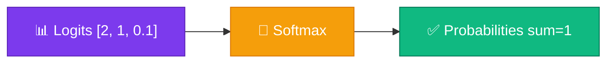
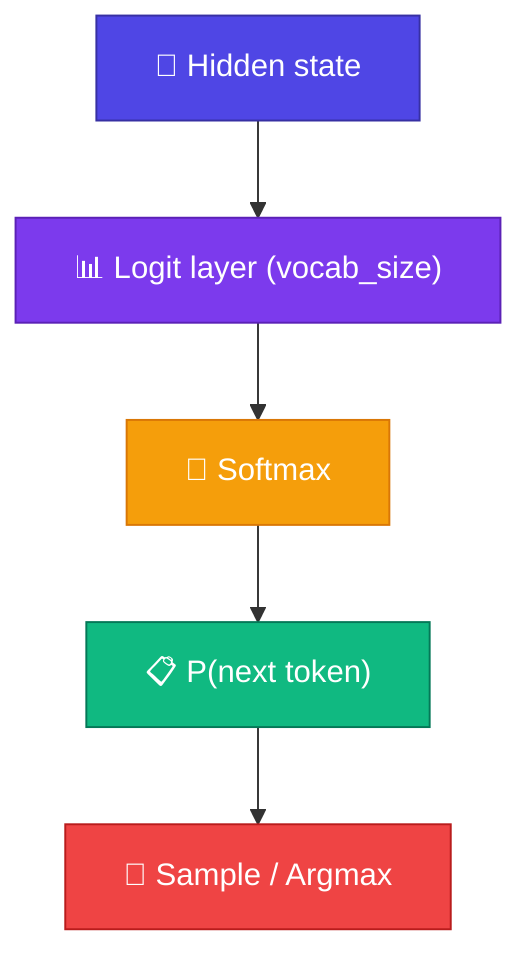

# 🎲 Softmax

<ConceptAnim name="softmax-bars" caption="Logits (violet) → Softmax normalize (green) → probability distribution" />

<Callout type="idea">
💡 Model raw **logits** output করে — softmax সেগুলো **probability**-তে convert করে যেখানে সব যোগ করলে exactly **1** হয়।
</Callout>

## কেন Softmax?

Bigram model-এ count normalize করেছিলাম। Neural network logits দেয়:

```
logits = [2.0, 1.0, 0.1]
```

এগুলো probability নয় — negative বা যোগ ≠ 1 হতে পারে। **Softmax** fix করে:

```
softmax = [0.659, 0.242, 0.099]   ← sum = 1.0 ✓
```



## Full Formula

<MathLesson title="Softmax">
  <MathIntuition>
    Logits বড় হলে probability বেশি — কিন্তু sum = 1 রাখতে normalize করতে হবে। exp() সব positive করে, তারপর divide by total।
  </MathIntuition>
  <SymbolTable symbols={[
    { sym: "z_i", meaning: "logit for class/token i (raw model output)" },
    { sym: "e^{z_i}", meaning: "exponential — makes all values positive" },
    { sym: "Σ_j e^{z_j}", meaning: "sum of all exponentials (normalizer)" },
    { sym: "n", meaning: "number of classes / vocabulary size" }
  ]} />
  <Formula>
    {`$$\\text{softmax}(z_i) = \\frac{e^{z_i}}{\\sum_{j=1}^{n} e^{z_j}}$$`}
  </Formula>
  <WorkedExample>
    z = [2.0, 1.0, 0.0]{'\n'}
    e^z = [7.389, 2.718, 1.000]{'\n'}
    sum = 11.107{'\n'}
    softmax ≈ [0.665, 0.245, 0.090]
  </WorkedExample>
  <CodeLink>Playground-এ same numbers run করো ↓</CodeLink>
</MathLesson>

## Step by Step

<StepReveal steps={[
  { emoji: "📈", title: "exp(z_i)", body: "প্রতিটা logit-এ exponential — সব positive" },
  { emoji: "➕", title: "Sum all exp values", body: "Normalizer = Σ e^z_j" },
  { emoji: "➗", title: "Divide each by sum", body: "Probability distribution তৈরি" },
  { emoji: "✅", title: "Verify sum = 1", body: "Sampling / loss-এর জন্য required" }
]} />

## Numerical Stability

Direct `exp(1000)` = overflow! Production code-এ **max trick** ব্যবহার:

```
z_stable = z - max(z)
softmax(z) = softmax(z_stable)   ← same result, no overflow
```

Playground-এ stable version implement করা আছে।

## LLM-এ Softmax



- Last layer → vocab_size logits
- Softmax → probability over all tokens
- Sample বা argmax → next token

## Code

## Interactive Demo

<Playground id="part-03/softmax" title="Softmax Calculator" viz="softmax" />

## ✅ তুমি কী শিখলে?

- **Softmax** converts logits → valid probability distribution
- Formula: `exp(z_i) / Σ exp(z_j)`
- Bigger logit → higher probability
- LLM output layer always ends with softmax (or equivalent)
- Use max-subtraction trick for numerical stability

**আগের lesson:** [Matrix Multiplication](/docs/part-03-math/04-matmul)

**পরের Module:** [Module 4 — Autograd](/docs/part-04-autograd/01-computational-graph)
