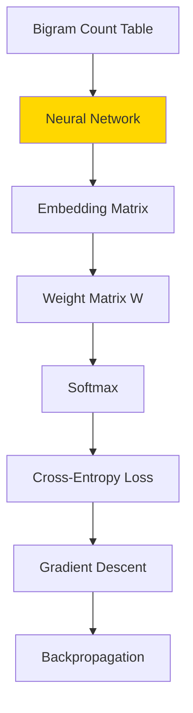
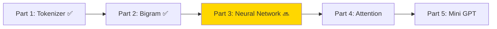

# Part 3: Neural Network + Gradient Descent

> 🔜 **Coming soon** — এই Part এখনো লেখা হচ্ছে।

## এই Part-এ কী শিখবে?

Bigram model counting দিয়ে কাজ করে। কিন্তু real LLM **Neural Network** ব্যবহার করে। এই Part-এ আমরা শিখব:

## Topics Preview

### Embedding

Count table-এর বদলে **learned vectors**:

$$E \in \mathbb{R}^{V \times D}$$

প্রতিটা word-এর জন্য $D$-dimensional vector। Similar word-এর vector কাছাকাছি হবে।

### Softmax

Raw scores (logits) কে probability-তে convert:

$$\text{softmax}(z_i) = \frac{e^{z_i}}{\sum_j e^{z_j}}$$

### Cross-Entropy Loss

Model কতটা ভুল করলো:

$$L = -\log P(\text{correct token})$$

### Gradient Descent

Error কমাতে weights update:

$$W \leftarrow W - \eta \cdot \frac{\partial L}{\partial W}$$

## Reference Code

Part 3-এর জন্য একটি character-level neural network reference আছে:

`code/part-03/neural-char.ts` — এটা baby names dataset-এ train করে নতুন নাম generate করে। Part 3-এ আমরা এটাকে word-level-এ port করব।

## Roadmap Position

**আগের Part:** [Part 2 — Bigram](/docs/part-02-bigram)
