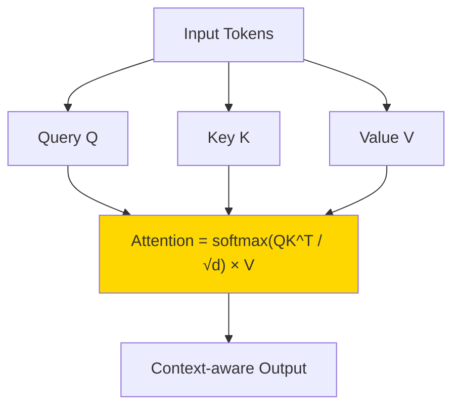
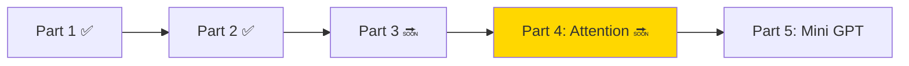

# Part 4: Self-Attention

> 🔜 **Coming soon** — এই Part এখনো লেখা হচ্ছে।

## এই Part-এ কী শিখবে?

Bigram শুধু ১টা আগের word দেখে। কিন্তু real sentence-এ **দূরের word-ও গুরুত্বপূর্ণ**। Attention এই সমস্যা solve করে।



## কেন Attention দরকার?

```
"The animal didn't cross the road because it was tired."
```

`"it"` কার দিকে point করে?

- `animal`? (tired → animal makes sense)
- `road`? (cross → road makes sense)

**Attention** এই decision নেয় — প্রতিটা word অন্য সব word-এর সাথে কতটা relevant সেটা measure করে।

## Topics Preview

### Query, Key, Value

$$\text{Attention}(Q, K, V) = \text{softmax}\left(\frac{QK^T}{\sqrt{d_k}}\right) V$$

- **Query**: "আমি কী খুঁজছি?"
- **Key**: "আমার কাছে কী আছে?"
- **Value**: "আমার actual information"

### Self-Attention

একই sequence-এর সব token একে অপরকে attend করে — তাই "Self"-Attention।

### Multi-Head Attention

একাধিক attention head parallel-এ run করে different pattern capture করে।

## Roadmap Position



**আগের Part:** [Part 3 — Neural Network](/docs/part-03-neural-network)
