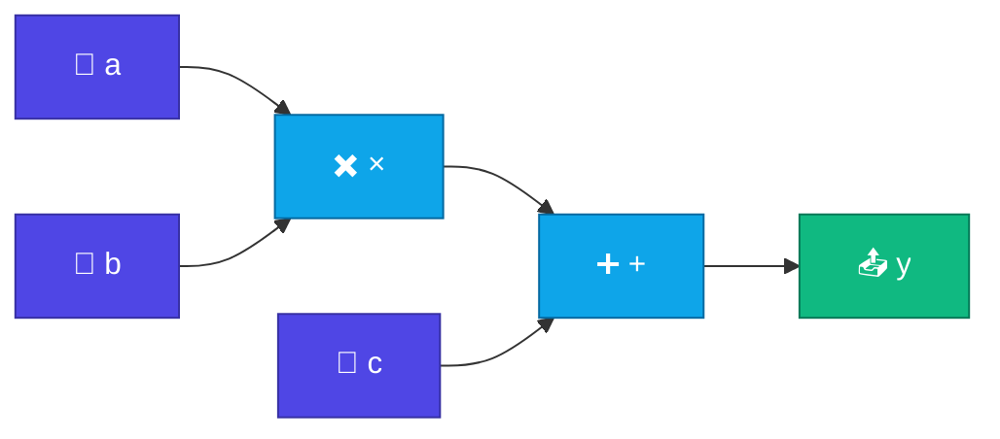
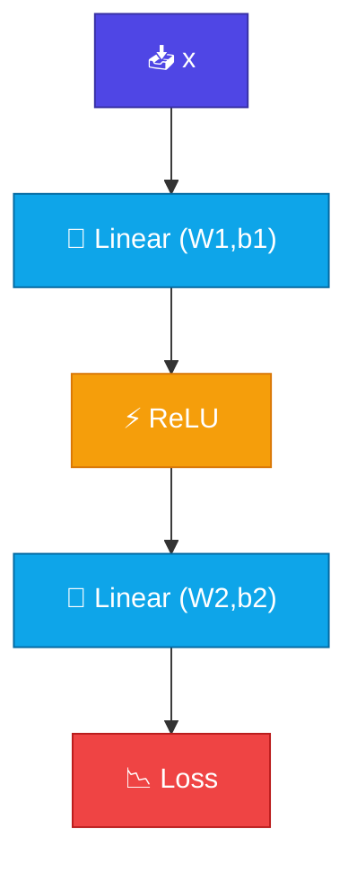

# Computational Graph

<ConceptAnim slug="part-04-autograd/01-computational-graph" />

<Callout type="idea">
Neural network computation = **directed graph**। Node = operation, edge = data flow। Backprop মানে এই graph reverse traverse করা।
</Callout>

Gradient বের করতে হলে আগে বুঝতে হবে computation কীভাবে সাজানো থাকে। সবকিছু একটা **computational graph** — আর Autograd সেই graph পড়ে কাজ করে।

## Graph কী?

Simple expression নাও: `y = (a × b) + c`



তিন ধরনের জিনিস দেখো:
- **Leaf nodes** = input values (a, b, c) — tunable weights বা data
- **Operation nodes** = +, ×, matmul, Softmax
- **Output** = final result (y, বা loss)

প্রতিটা ধাপ মনে রাখা হয় — পরে backward-এ সেই memoryই কাজে লাগে।

## Forward Pass কী

Data **left → right** flow করে। Example: `a=2, b=3, c=2` → `y = 8`

<StepReveal steps={[
  { emoji: "1️⃣", title: "a × b = 6", body: "Multiply node হিসাব করে, result রাখে" },
  { emoji: "2️⃣", title: "6 + c = 8", body: "Add node upstream value নেয়" },
  { emoji: "3️⃣", title: "y = 8", body: "Final output ready" },
  { emoji: "4️⃣", title: "Graph stored", body: "প্রতিটা node backward-এর জন্য child মনে রাখে" }
]} />

Forward শুধু উত্তর বের করে না — পুরো পথও রেখে দেয়, যাতে পরে “কে কাকে প্রভাবিত করেছে?” জানা যায়।

## Neural Network-এর Graph

আসল network-এও একই idea, শুধু বড়:

```
x → [Linear] → [ReLU] → [Linear] → loss
         ↑                  ↑
       W1, b1             W2, b2
```



প্রতিটা **parameter** (W1, b1, W2, b2) leaf node — Gradient Descent-এ এগুলোই update হবে।

## কেন Graph দরকার?

হাতে derivative লিখলে ছোট example-এ চলে। কিন্তু deep net-এ লক্ষ লক্ষ parameter — সেখানে manual কাজ অসম্ভব।

| Without graph | With graph |
|---------------|------------|
| Manual gradient by hand | Automatic via chain rule |
| Error-prone for deep nets | Scale to millions of params |
| Hard to debug | Trace which op caused what |

**Autograd** = forward-এ graph build, backward-এ traverse। PyTorch/TensorFlow-ও ভিতরে এটাই করে।

## micrograd-এর Idea

Andrej Karpathy-র [micrograd](https://github.com/karpathy/micrograd) — প্রায় ১০০ লাইন Python:

1. Every number wrapped in `Value` class
2. Operations build graph edges automatically
3. `.backward()` traverses graph in reverse

আমরা same pattern TypeScript-এ implement করব। ছোট engine, বড় intuition।

## Chain Rule-এর Preview

Graph থেকে backward pass কেমন দেখায় — শুধু একটু ঝলক:

```
∂loss/∂W2 ← ∂loss/∂output × ∂output/∂W2
∂loss/∂W1 ← ∂loss/∂W2 × ∂W2/∂hidden × ∂hidden/∂W1
```

পরের lesson-এ `Value` class দিয়ে এটা code-এ নামিয়ে আনব। এখন শুধু বুঝো: gradient পেছন দিকে chain rule দিয়েই যায়।

## তুমি কী শিখলে?

- **Computational graph** = operation node, data edge — হিসাবের পথ আঁকা
- **Forward pass** = বাম থেকে ডানে evaluate করা
- **Backward pass** = ডান থেকে বামে chain rule দিয়ে gradient বের করা
- এই graph-ই **Autograd** (automatic differentiation) সম্ভব করে
- micrograd pattern: সাধারণ number-কে `Value` class-এ wrap করা

**আগের Module:** [Module 3 — Softmax](/docs/part-03-math/05-softmax)

**পরের lesson:** [Value Class](/docs/part-04-autograd/02-value)
