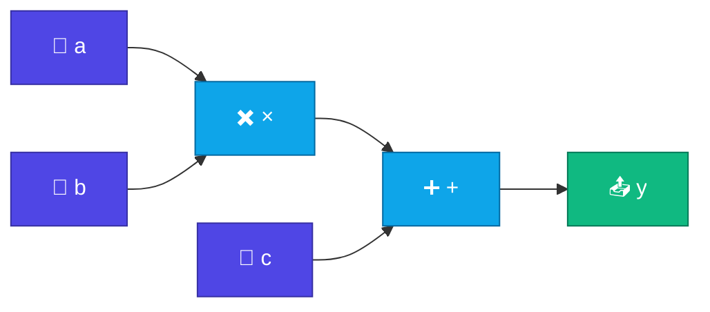
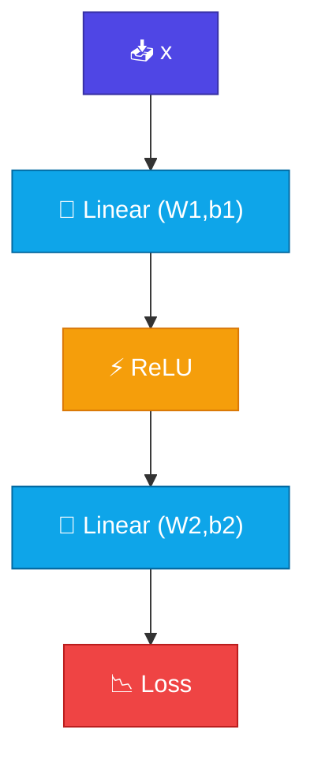

# 📊 Computational Graph

<ConceptAnim name="train-loop" caption="Computational graph" />

<Callout type="idea">
💡 Neural network computation = **directed graph**। Node = operation, edge = data flow। Backprop = এই graph reverse traverse।
</Callout>

## Graph কী?

Simple expression: `y = (a × b) + c`



- **Leaf nodes** = input values (a, b, c) — tunable weights বা data
- **Operation nodes** = +, ×, matmul, softmax
- **Output** = final result (y, or loss)

## Forward Pass

Data **left → right** flow করে:

<StepReveal steps={[
  { emoji: "1️⃣", title: "a × b = 6", body: "Multiply node computes, stores result" },
  { emoji: "2️⃣", title: "6 + c = 8", body: "Add node receives upstream value" },
  { emoji: "3️⃣", title: "y = 8", body: "Final output ready" },
  { emoji: "4️⃣", title: "Graph stored", body: "Each node remembers children for backward" }
]} />

Example: `a=2, b=3, c=2` → `y = 8`

## Neural Network Graph

```
x → [Linear] → [ReLU] → [Linear] → loss
         ↑                  ↑
       W1, b1             W2, b2
```



প্রতিটা **parameter** (W1, b1, W2, b2) leaf node — gradient descent-এ update হবে।

## কেন Graph দরকার?

| Without graph | With graph |
|---------------|------------|
| Manual gradient by hand | Automatic via chain rule |
| Error-prone for deep nets | Scale to millions of params |
| Hard to debug | Trace which op caused what |

**Autograd** = graph build during forward, traverse during backward.

## micrograd Idea

Andrej Karpathy-র [micrograd](https://github.com/karpathy/micrograd) — ~100 lines Python:

1. Every number wrapped in `Value` class
2. Operations build graph edges automatically
3. `.backward()` traverses graph in reverse

আমরা same pattern TypeScript-এ implement করব।

## Chain Rule Preview

Graph থেকে backward pass:

```
∂loss/∂W2 ← ∂loss/∂output × ∂output/∂W2
∂loss/∂W1 ← ∂loss/∂W2 × ∂W2/∂hidden × ∂hidden/∂W1
```

পরের lesson-এ `Value` class দিয়ে এটা code-এ implement করব।

## ✅ তুমি কী শিখলে?

- **Computational graph** = operations as nodes, data as edges
- **Forward pass** = left-to-right evaluation
- **Backward pass** = right-to-left gradient via chain rule
- Graph enables automatic differentiation (autograd)
- micrograd pattern: wrap numbers in `Value` class

**আগের Module:** [Module 3 — Softmax](/docs/part-03-math/05-softmax)

**পরের lesson:** [Value Class](/docs/part-04-autograd/02-value)
