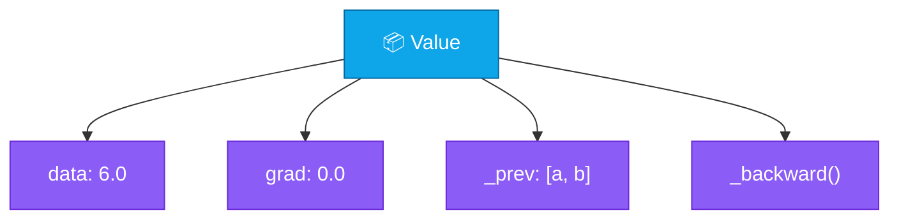
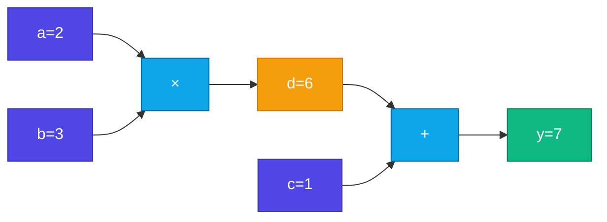

# Value Class

<ConceptAnim slug="part-04-autograd/02-value" />

<Callout type="idea">
**Value** = এমন একটা number যেটা জানে কোথা থেকে এসেছে (parents), আর `.backward()` call করলে gradient propagate করে।
</Callout>

আগের lesson-এ graph-এর ধারণা দেখেছি। এখন সেই graph code-এ নামিয়ে আনব — প্রতিটা সংখ্যাকে `Value` দিয়ে wrap করে।

## Value-এর Anatomy

একটা `Value`-এ চারটা জিনিস থাকে: data, grad, parents, আর local backward rule।



`data` = forward-এর ফল। `grad` = পরে জমা হওয়া gradient। `_prev` = এই মান কার থেকে এসেছে। `_backward` = local chain rule।

## Operation Graph বানায়

যখন `add` বা `mul` করো, তিনটা কাজ একসাথে হয়:
1. New `Value` create — result store
2. `_prev` = parent nodes link
3. `_backward` = local chain rule define

<StepReveal steps={[
  { emoji: "➕", title: "add()", body: "∂(a+b)/∂a = 1, ∂(a+b)/∂b = 1" },
  { emoji: "✖️", title: "mul()", body: "∂(a×b)/∂a = b, ∂(a×b)/∂b = a" },
  { emoji: "📈", title: "relu()", body: "∂relu/∂x = 1 if x>0 else 0" },
  { emoji: "🔗", title: "Graph বাড়ে", body: "প্রতিটা op নিজে থেকে node যোগ করে" }
]} />

তুমি শুধু `a.mul(b).add(c)` লিখলেই graph নিজে নিজে বড় হয় — আলাদা করে graph draw করতে হয় না।

## উদাহরণ: y = a × b + c

Graph structure দেখো — leaf থেকে output পর্যন্ত:



Forward-এ `y = 7` পাও। Backward-এ এই edges ধরেই gradient ফিরে আসবে।

## Gradient Accumulation কী

গুরুত্বপূর্ণ detail: `grad +=` (not `=`)। কেন? একটা node multiple path দিয়ে use হতে পারে:

```
     b
    ↙ ↘
  a×b   b+c
    ↘ ↙
     sum
```

এখানে `b.grad` দুই পথ থেকে আসা gradient যোগ করে নেবে। `=` দিলে এক পথ হারিয়ে যেত।

## সাধারণ Number কেন নয়?

সাধারণ `number` দিয়ে forward চলে, কিন্তু history থাকে না — তাই automatic backwardও হয় না।

| Plain `number` | `Value` |
|----------------|---------|
| No graph history | Parents tracked |
| Manual chain rule | Auto via `_backward` |
| Can't call `.backward()` | Full Autograd |

PyTorch-এ `Tensor` same idea — `requires_grad=True` মানেই এই tracking চালু। আমরা ছোট স্কেলে একই জিনিস বানাচ্ছি।

## নিজে চেষ্টা করো

<Playground id="part-04/value" title="Value Class" />

## তুমি কী শিখলে?

- **Value** একটা number-কে graph metadata সহ wrap করে
- `data` = forward-এর মান, `grad` = জমা হওয়া gradient
- Operationগুলো `_prev` আর `_backward` দিয়ে নিজে থেকে graph বানায়
- Shared node-এ gradient **`+=`** দিয়ে accumulate হয়
- এটাই automatic Backpropagation-এর foundation

**আগের lesson:** [Computational Graph](/docs/part-04-autograd/01-computational-graph)

**পরের lesson:** [Backpropagation](/docs/part-04-autograd/03-backprop)
