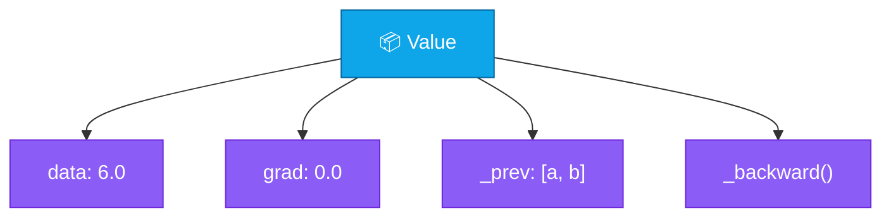
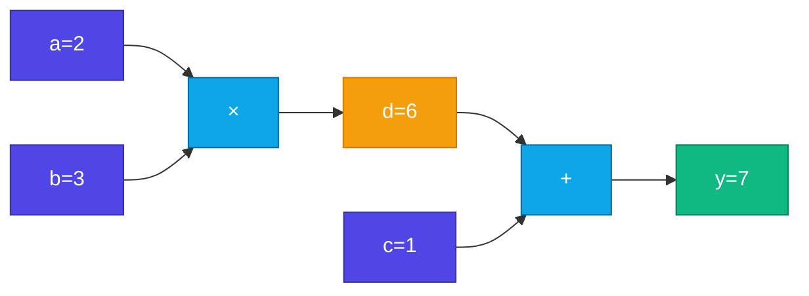

# 📦 Value Class

<Callout type="idea">
💡 **Value** = number যেটা জানে কোথা থেকে এসেছে (parents) এবং `.backward()` call করলে gradient propagate করে।
</Callout>

## Anatomy of Value

```ts
class Value {
  data: number;      // forward pass value
  grad: number;      // gradient (accumulated)
  _prev: Value[];    // parent nodes in graph
  _backward: () => void;  // local gradient rule
}
```



## Operations Build the Graph

```ts
add(other: Value): Value {
  const out = new Value(this.data + other.data, [this, other]);
  out._backward = () => {
    this.grad += 1.0 * out.grad;
    other.grad += 1.0 * out.grad;
  };
  return out;
}
```

Operation করলে:
1. New `Value` create — result store
2. `_prev` = parent nodes link
3. `_backward` = local chain rule define

<StepReveal steps={[
  { emoji: "➕", title: "add()", body: "∂(a+b)/∂a = 1, ∂(a+b)/∂b = 1" },
  { emoji: "✖️", title: "mul()", body: "∂(a×b)/∂a = b, ∂(a×b)/∂b = a" },
  { emoji: "📈", title: "relu()", body: "∂relu/∂x = 1 if x>0 else 0" },
  { emoji: "🔗", title: "Graph grows", body: "Each op adds nodes automatically" }
]} />

## Example: y = a × b + c

```ts
const a = new Value(2);
const b = new Value(3);
const c = new Value(1);

const d = a.mul(b);   // d = 6, graph: a,b → d
const y = d.add(c);   // y = 7, graph: d,c → y
```

Graph structure:



## Gradient Accumulation

`grad +=` (not `=`) — একটা node multiple path-এ use হতে পারে:

```
     b
    ↙ ↘
  a×b   b+c
    ↘ ↙
     sum
```

`b.grad` = gradient from both paths যোগ হবে।

## Why Not Plain Numbers?

| Plain `number` | `Value` |
|----------------|---------|
| No graph history | Parents tracked |
| Manual chain rule | Auto via `_backward` |
| Can't call `.backward()` | Full autograd |

PyTorch-এ `Tensor` same idea — requires_grad=True।

## Interactive Demo

<Playground id="part-04/value" title="Value Class" />

## ✅ তুমি কী শিখলে?

- **Value** wraps a number with graph metadata
- `data` = forward value, `grad` = accumulated gradient
- Operations auto-build graph via `_prev` and `_backward`
- Gradient accumulation uses `+=` for shared nodes
- Foundation for automatic backpropagation

**আগের lesson:** [Computational Graph](/docs/part-04-autograd/01-computational-graph)

**পরের lesson:** [Backpropagation](/docs/part-04-autograd/03-backprop)
