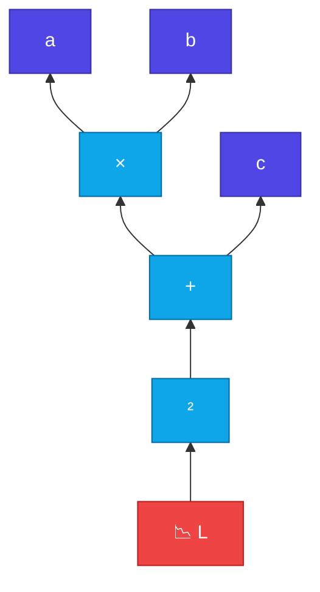

# Backpropagation

<ConceptAnim slug="part-04-autograd/03-backprop" />

<Callout type="idea">
**Backpropagation** = computational graph reverse traverse করে chain rule apply করা। Loss থেকে শুরু, root পর্যন্ত gradient flow।
</Callout>

`Value` class graph বানাতে পারে — এখন সেই graph পেছন দিকে হাঁটাবো। এটাই training-এর হৃদয়: loss দেখে প্রতিটা weight-কে বলা “তুমি কতটা দায়ী?”

## The Algorithm

চল ধাপে ধাপে:

<StepReveal steps={[
  { emoji: "📋", title: "Topological sort", body: "Nodes order — children before parents" },
  { emoji: "1️⃣", title: "Seed grad = 1", body: "Output node (loss) starts with ∂L/∂L = 1" },
  { emoji: "⬅️", title: "Reverse loop", body: "Each node calls _backward()" },
  { emoji: "➕", title: "Accumulate grads", body: "Parents receive gradient contributions" }
]} />

Seed দিয়ে শুরু — `∂L/∂L = 1`। তারপর প্রতিটা node তার local rule দিয়ে parent-দের কাছে gradient পাঠায়।

## Chain Rule in Action

Expression: `L = (a × b + c)²`



Backward (diagram-এ bottom-up = reverse topo order):

```
∂L/∂L = 1
∂L/∂(square input) = 2 × input × ∂L/∂L
∂L/∂a = ∂L/∂(ab) × b
∂L/∂b = ∂L/∂(ab) × a
∂L/∂c = ∂L/∂(sum) × 1
```

প্রতিটা ধাপে local derivative × incoming gradient — এটাই chain rule।

## Worked Example

সংখ্যা দিয়ে দেখি। `a=2, b=-3, c=10` → inner = 2×(-3)+10 = 4 → L = 16

<MathLesson title="Backprop Chain Rule">
  <MathIntuition>
    Gradient পেছন দিকে পানি চলার মতো যায় — প্রতিটা node নিজের local derivative দিয়ে parent-দের কাছে ভাগ করে দেয়। Upstream gradient × local rule = নতুন flow।
  </MathIntuition>
  <SymbolTable symbols={[
    { sym: "∂L/∂y", meaning: "উপর থেকে node y-তে আসা gradient" },
    { sym: "_backward()", meaning: "local rule — parent-দের কাছে grad ভাগ করে দেয়" },
    { sym: "topo sort", meaning: "child আগে, parent পরে — সঠিক ক্রম" }
  ]} />
  <Formula>
    {`$$\\frac{\\partial L}{\\partial x} = \\frac{\\partial L}{\\partial y} \\cdot \\frac{\\partial y}{\\partial x}$$`}
  </Formula>
  <MathPractical title="গণনা দেখো (ধাপে ধাপে)">
    <div>১. দেওয়া: <code>a = 2</code>, <code>b = −3</code>, <code>c = 10</code> — এবং <code>L = (a×b + c)²</code></div>
    <div>২. Forward: <code>a×b = −6</code>, <code>−6 + 10 = 4</code>, <code>L = 4² = 16</code></div>
    <div>৩. Seed: <code>∂L/∂L = 1</code></div>
    <div>৪. Square: <code>∂L/∂(inner) = 2 × 4 × 1 = 8</code></div>
    <div>৫. Add: <code>∂L/∂(a×b) = 8</code>, <code>∂L/∂c = 8</code></div>
    <div>৬. Multiply: <code>∂L/∂a = 8 × b = 8 × (−3) = −24</code>, <code>∂L/∂b = 8 × a = 16</code></div>
  </MathPractical>
  <CodeLink>Playground-এ backward() run করে grad values verify করো ↓</CodeLink>
</MathLesson>

## Why Topological Sort?

Operation order matter করে। Parent-এর `_backward()` call হওয়ার **আগে** child-এর grad ready থাকতে হবে:

```
Wrong order: parent._backward() before child.grad set → wrong gradients
Right order: reverse topo ensures child processed first
```

Topo sort ভুল হলে gradientও ভুল — bug খুঁজতে গিয়ে অনেক সময় এখানেই আটকায়।

## Debugging Tips

Gradient zero? চেক করো:
- `_backward` rule correct?
- Topo sort order correct?
- Forgot to call `.backward()`?

তিনটার মধ্যে একটা miss হলেই training “শেখে” না।

## Interactive Demo

<Playground id="part-04/backprop" title="Backpropagation Demo" />

## তুমি কী শিখলে?

- **Backprop** = reverse topological traversal + chain rule
- Output node seeded with `grad = 1`
- Each `_backward()` distributes gradient to parents
- Topological sort ensures correct order
- Enables training networks with millions of parameters

**আগের lesson:** [Value Class](/docs/part-04-autograd/02-value)

**পরের lesson:** [Gradient Descent](/docs/part-04-autograd/04-gradient-descent)
