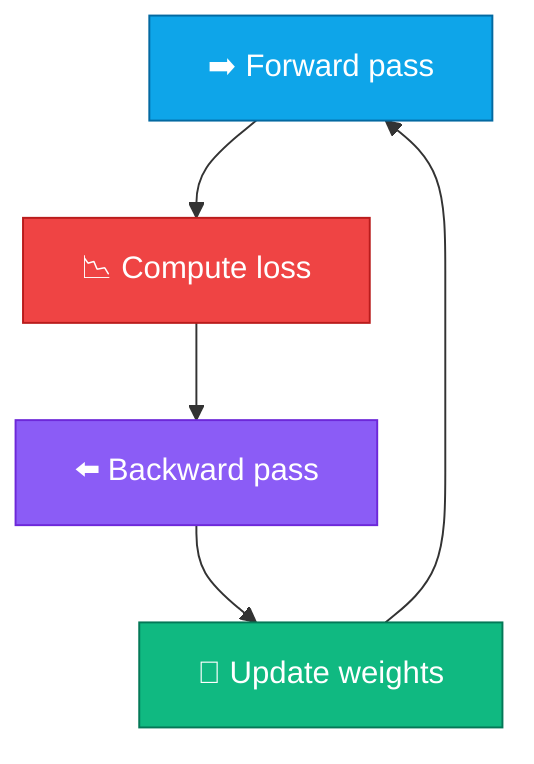

# Gradient Descent

<ConceptAnim slug="part-04-autograd/04-gradient-descent" />

<Callout type="idea">
**Gradient** বলে loss কোন দিকে বাড়ছে। **Gradient Descent** = উল্টো দিকে ছোট একটা step — loss কমাতে weight update।
</Callout>

এখন আমাদের কাছে gradient আছে। কিন্তু gradient একা কিছু করে না — দিয়ে weight আপডেট করতে হয়। সেই আপডেটের নিয়মই Gradient Descent।

## Update Rule কেমন

Idea একদম সরল: loss বাড়ার দিকের উল্টো দিকে হাঁটো।

<MathLesson title="Gradient Descent">
  <MathIntuition>
    Loss landscape-এ downhill যাও — gradient positive হলে weight কমাও, negative হলে weight বাড়াও। Learning rate বলে প্রতি step কতদূর যাবে।
  </MathIntuition>
  <SymbolTable symbols={[
    { sym: "w", meaning: "weight — যে parameter optimize করছি" },
    { sym: "L", meaning: "loss function" },
    { sym: "∂L/∂w", meaning: "gradient — w বদলালে L কতটা বদলায়" },
    { sym: "α", meaning: "learning rate (step size, যেমন 0.01)" }
  ]} />
  <Formula>
    {`$$w \\leftarrow w - \\alpha \\cdot \\frac{\\partial L}{\\partial w}$$`}
  </Formula>
  <MathPractical title="গণনা দেখো (ধাপে ধাপে)">
    <div>১. দেওয়া: <code>w = 3.0</code>, <code>∂L/∂w = 4.0</code>, learning rate <code>α = 0.1</code></div>
    <div>২. Update rule: <code>w ← w − α · ∂L/∂w</code></div>
    <div>৩. গণনা: <code>w_new = 3.0 − 0.1 × 4.0 = 3.0 − 0.4 = 2.6</code></div>
    <div>৪. Gradient ধনাত্মক → weight কমিয়েছি — loss কমানোর দিকে সরেছি</div>
  </MathPractical>
  <CodeLink>Playground-এ training loop run করো ↓</CodeLink>
</MathLesson>

## Training Loop কীভাবে চলে

পুরো training একেকটা loop:



<StepReveal steps={[
  { emoji: "➡️", title: "Forward", body: "Input দিয়ে prediction + loss compute" },
  { emoji: "⬅️", title: "Backward", body: "loss.backward() — সব param-এ grad" },
  { emoji: "🔧", title: "Update", body: "w -= lr × grad" },
  { emoji: "🔄", title: "Repeat", body: "Loss ধীরে ধীরে কমে" }
]} />

প্রতি epoch-এ একই চার ধাপ — GPT train করতেও ভিতরে এই loopই চলে, শুধু অনেক বড় স্কেলে।

## Learning Rate কী করে

Learning rate (`α`) খুবই sensitive। একটু বেশি বা কম হলেই সমস্যা:

| α too small | α too large | α just right |
|-------------|-------------|--------------|
| Slow convergence | Overshoot, diverge | Steady loss decrease |
| Many epochs needed | Loss oscillates or NaN | Efficient training |

Typical values: `0.001` – `0.1` (problem-dependent)। শুরুতে ছোট দিয়ে দেখো, দরকার হলে বাড়াও।

আর একটা ভুল ভুলো না: update-এর পর `grad = 0` reset করতে হয় — নাহলে পরের step-এ পুরনো gradient জমে যায়।

## Loss Curve পড়ো

Training-এ loss overtime track করি — কমতে থাকলে বোঝা যায় শেখা চলছে:

<LossChart
  data={[2.5, 1.8, 1.1, 0.6, 0.3, 0.15]}
  title="Example Loss Curve"
/>

Module 6–9-এ live loss chart training-এর সাথে update হবে।

## পুরো ছবি

এখন পর্যন্ত কী জোড়া লেগেছে, এক নজরে:

```
Math (Module 3)     → operations
Autograd (Module 4) → gradients
Gradient Descent    → weight updates
Neural Net (Module 5) → architecture to train
```

পরের Module-এ এই engine দিয়ে সত্যিকারের Neuron → Layer → MLP বানাবো।

## নিজে চেষ্টা করো

<Playground id="part-04/gradient-descent" title="Gradient Descent Training" />

## তুমি কী শিখলে?

- **Gradient Descent**: `w ← w - α × ∂L/∂w`
- Training loop = forward → backward → update → আবার repeat
- **Learning rate (α)** step size control করে — critical hyperparameter
- প্রতিটা update-এর পর `grad = 0` reset করতে হয়
- GPT সহ প্রতিটা neural network এভাবেই শেখে

**আগের lesson:** [Backpropagation](/docs/part-04-autograd/03-backprop)

**পরের Module:** [Module 5 — Neural Network](/docs/part-05-neural-network/01-neuron)
