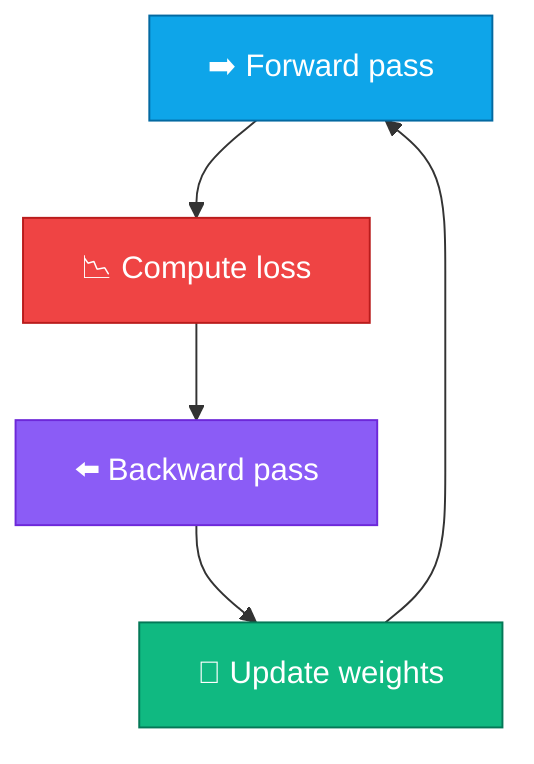

# 📉 Gradient Descent

<ConceptAnim name="train-loop" caption="Gradient descent update" />

<Callout type="idea">
💡 **Gradient** বলে loss কোন direction-এ বাড়ছে। **Gradient descent** = opposite direction-এ small step — loss কমাতে weight update।
</Callout>

## The Update Rule

<MathLesson title="Gradient Descent">
  <MathIntuition>
    Loss landscape-এ downhill যাও — gradient positive হলে weight কমাও, negative হলে weight বাড়াও। Learning rate step size control করে।
  </MathIntuition>
  <SymbolTable symbols={[
    { sym: "w", meaning: "weight (parameter to optimize)" },
    { sym: "L", meaning: "loss function" },
    { sym: "∂L/∂w", meaning: "gradient — how loss changes w.r.t. w" },
    { sym: "α", meaning: "learning rate (step size, e.g. 0.01)" }
  ]} />
  <Formula>
    {`$$w \\leftarrow w - \\alpha \\cdot \\frac{\\partial L}{\\partial w}$$`}
  </Formula>
  <WorkedExample>
    w = 3.0, ∂L/∂w = 4.0, α = 0.1{'\n'}
    w_new = 3.0 - 0.1 × 4.0 = 2.6{'\n'}
    (loss decreases because we moved opposite to gradient)
  </WorkedExample>
  <CodeLink>Playground-এ training loop run করো ↓</CodeLink>
</MathLesson>

## Training Loop



<StepReveal steps={[
  { emoji: "➡️", title: "Forward", body: "Input দিয়ে prediction + loss compute" },
  { emoji: "⬅️", title: "Backward", body: "loss.backward() — সব param-এ grad" },
  { emoji: "🔧", title: "Update", body: "w -= lr × grad" },
  { emoji: "🔄", title: "Repeat", body: "Loss gradually decreases" }
]} />

## Learning Rate

| α too small | α too large | α just right |
|-------------|-------------|--------------|
| Slow convergence | Overshoot, diverge | Steady loss decrease |
| Many epochs needed | Loss oscillates or NaN | Efficient training |

Typical values: `0.001` – `0.1` (problem-dependent)

## Loss Curve

Training-এ loss overtime track করি:

<LossChart
  data={[2.5, 1.8, 1.1, 0.6, 0.3, 0.15]}
  title="Example Loss Curve"
/>

Module 6-9-এ live loss chart training-এর সাথে update হবে।

## Full Picture

```
Math (Module 3)     → operations
Autograd (Module 4) → gradients
Gradient Descent    → weight updates
Neural Net (Module 5) → architecture to train
```

## Interactive Demo

<Playground id="part-04/gradient-descent" title="Gradient Descent Training" />

## ✅ তুমি কী শিখলে?

- **Gradient descent**: `w ← w - α × ∂L/∂w`
- Training loop = forward → backward → update → repeat
- **Learning rate** controls step size — critical hyperparameter
- Reset `grad = 0` after each update
- This is how every neural network (including GPT) learns

**আগের lesson:** [Backpropagation](/docs/part-04-autograd/03-backprop)

**পরের Module:** [Module 5 — Neural Network](/docs/part-05-neural-network/01-neuron)
