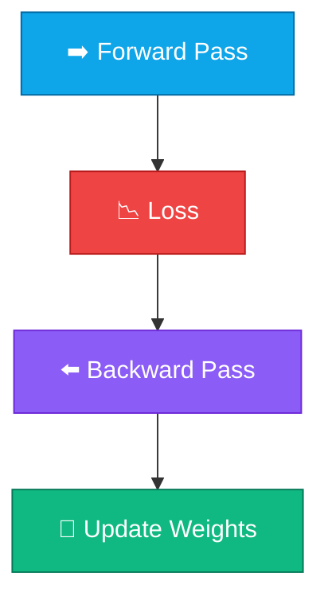

# Module 4: Autograd

Module 3-এ আমরা math tools বানিয়েছি — Vector, Matrix, Softmax। কিন্তু neural network **train** করতে হলে আরও একটা প্রশ্ন লাগে: “এই weight একটু বাড়ালে loss কমে, নাকি বাড়ে?” সেই উত্তরই **gradient**।

<Callout type="idea">
**Autograd** = forward pass-এ graph বানাও, backward pass-এ chain rule দিয়ে gradient বের করো। Andrej Karpathy-র **micrograd** idea-টাই follow করব — ছোট, পরিষ্কার, বোঝার মতো।
</Callout>

এই Module-এ আমরা নিজের হাতে একটা ছোট Autograd engine বানাবো। পরে Module 5-এ সেটা দিয়েই neuron train করব।

<StepReveal steps={[
  { emoji: "📊", title: "Computational Graph", body: "Operation-গুলো node, data flow edge" },
  { emoji: "📦", title: "Value Class", body: "Number + gradient + backward hook" },
  { emoji: "⬅️", title: "Backpropagation", body: "Loss থেকে root পর্যন্ত chain rule" },
  { emoji: "📉", title: "Gradient Descent", body: "Gradient দিয়ে weight update" }
]} />

## Lessons

| # | Lesson | Topic |
|---|--------|-------|
| 4.1 | [Computational Graph](/docs/part-04-autograd/01-computational-graph) | Forward pass visualization |
| 4.2 | [Value Class](/docs/part-04-autograd/02-value) | micrograd-style Value |
| 4.3 | [Backpropagation](/docs/part-04-autograd/03-backprop) | Manual backward pass |
| 4.4 | [Gradient Descent](/docs/part-04-autograd/04-gradient-descent) | Weight update loop |

Module 4-এর সব Playground **browser-এ esbuild-wasm** দিয়ে চলে — training loop সহ পুরো course browser-এ চলে, কোনো extra runtime লাগে না।

**আগের Module:** [Module 3 — Math](/docs/part-03-math)

**পরের lesson:** [Computational Graph](/docs/part-04-autograd/01-computational-graph)
