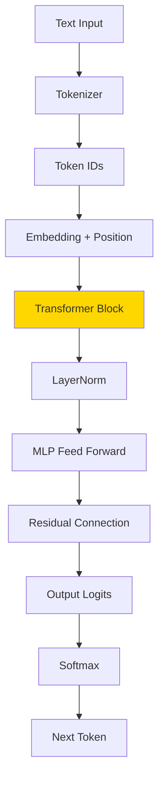
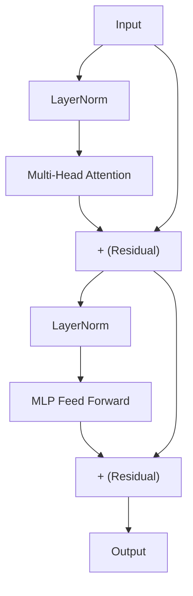

# Part 5: Mini GPT (Transformer)

> 🔜 **Coming soon** — এই Part এখনো লেখা হচ্ছে।

## এই Part-এ কী শিখবে?

সব কিছু মিলিয়ে একটি **সম্পূর্ণ Transformer-based Language Model** বানাবো — Karpathy-এর nanoGPT-এর মতো, কিন্তু TypeScript-এ, zero library।



## Transformer Block

GPT-এর একটি সম্পূর্ণ block:



## Topics Preview

| Component | কাজ |
|-----------|-----|
| **Embedding** | Token ID → vector |
| **Positional Encoding** | Position information যোগ |
| **Multi-Head Attention** | Context-aware representation |
| **LayerNorm** | Training stabilize করা |
| **MLP (Feed Forward)** | Non-linear transformation |
| **Residual Connection** | Gradient flow ঠিক রাখা |

## Final Goal

~500-700 lines TypeScript, কোনো ML framework ছাড়া:

```bash
bun part-05   # Train mini GPT + generate text
```

## Roadmap — পুরো Journey


তুমি Part 1-2 শেষ করলে — তুমি ইতিমধ্যে একটি working language model বানিয়েছো! Part 3-5 তোমাকে GPT-level understanding-এ নিয়ে যাবে।

**আগের Part:** [Part 4 — Attention](/docs/part-04-attention)
