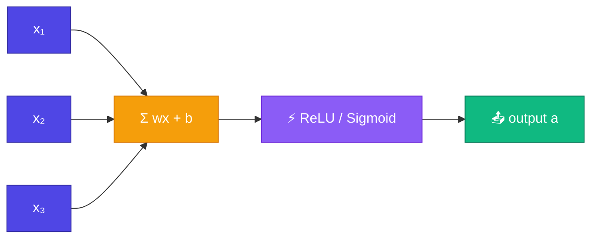

# Neuron

<ConceptAnim slug="part-05-neural-network/01-neuron" />

<Callout type="idea">
একটা **Neuron** = inputs-কে weight দিয়ে যোগ + bias + **activation function**। Biological neuron-এর digital version — ছোট, কিন্তু পুরো network-এর ইট।
</Callout>

Module 4-এ আমরা gradient বের করতে শিখেছি। এখন সেই `Value` দিয়ে সবচেয়ে ছোট building block বানাবো — একটা **Neuron**।

## Anatomy — ভেতরে কী আছে

Input আসে, weight দিয়ে গুণ হয়, bias যোগ হয়, তারপর activation:

```
inputs:  x₁, x₂, x₃
weights: w₁, w₂, w₃
bias:    b

z = w₁x₁ + w₂x₂ + w₃x₃ + b    ← weighted sum (pre-activation)
a = activation(z)              ← output
```



Module 3-এর dot product মনে আছে? `z = w · x + b` — ঠিক সেই কাজই।

## Activation Functionগুলো

Activation **non-linearity** যোগ করে। ছাড়া multi-layer net গাণিতিকভাবে একটা single linear layer-এর সমান হয়ে যায় — তাহলে গভীর নেটওয়ার্কের মানে থাকে না।

| Function | Formula | Range |
|----------|---------|-------|
| ReLU | `max(0, z)` | [0, ∞) |
| Sigmoid | `1 / (1 + e⁻ᶻ)` | (0, 1) |
| Tanh | `(eᶻ - e⁻ᶻ) / (eᶻ + e⁻ᶻ)` | (-1, 1) |

আধুনিক net-এ ReLU খুব common — সহজ, আর gradientও ভালো যায়।

<StepReveal steps={[
  { emoji: "✖️", title: "Weighted sum", body: "z = Σ(wᵢ × xᵢ) + b" },
  { emoji: "⚡", title: "Activation", body: "z-এর non-linear transform" },
  { emoji: "📤", title: "Output", body: "a = activation(z)" },
  { emoji: "🔗", title: "Value graph", body: "Autograd-এ each step tracked" }
]} />

## কোড

`z = Σ(wᵢxᵢ) + b` তারপর activation — নীচের Playground-এ weight বদলে Neuron output দেখো। প্রতিটা ধাপ `Value` দিয়ে track হয়, তাই পরে backwardও চলবে।

## উদাহরণ

একটা সংখ্যার উদাহরণ — ReLU negative হলে শূন্য করে দেয়:

```
inputs  = [1.0, 2.0, -1.0]
weights = [0.5, -1.0, 2.0]
bias    = 0.1

z = (0.5×1) + (-1×2) + (2×-1) + 0.1 = -3.4
a = ReLU(-3.4) = 0.0   ← negative, so zero output
```

## Neuron কেন গুরুত্বপূর্ণ

একটা Neuron একা খুব শক্তিশালী নয়। কিন্তু অনেকগুলো একসাথে — **universal approximator**: যথেষ্ট Neuron থাকলে প্রায় যেকোনো function approximate করা যায়। GPT-এও billions of Neuron (layer-এ গুচ্ছবদ্ধ) — শুরুটা কিন্তু এই একটা ইট দিয়েই।

## কোড চেষ্টা করো

<Playground id="part-05/neuron" title="Single Neuron" />

## তুমি কী শিখলে?

- **Neuron** = weighted sum + bias + activation
- **Weighted sum**: `z = Σ(wᵢxᵢ) + b` — input-এর weighted যোগ
- **Activation** non-linearity যোগ করে (ReLU, Sigmoid, Tanh)
- Activation ছাড়া deep network শুধু একটা linear map হয়ে যায়
- Autograd-এর জন্য `Value` class দিয়েই build করা

**আগের Module:** [Module 4 — Gradient Descent](/docs/part-04-autograd/04-gradient-descent)

**পরের lesson:** [Layer](/docs/part-05-neural-network/02-layer)
