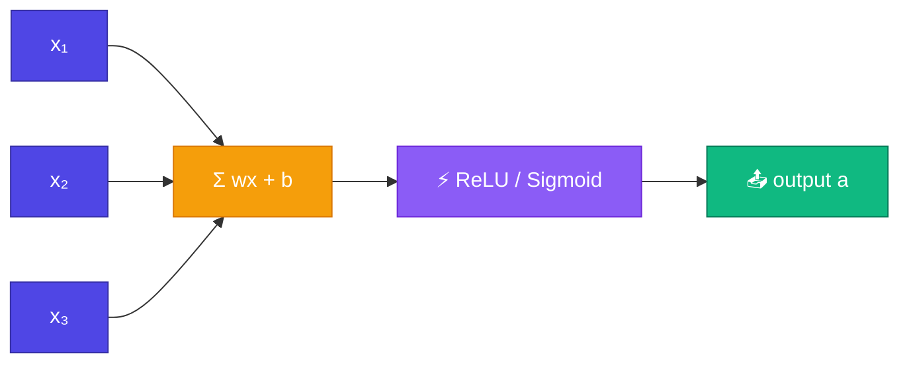

# 🧬 Neuron

<ConceptAnim slug="part-05-neural-network/01-neuron" />

<Callout type="idea">
💡 একটা **neuron** = inputs-কে weight দিয়ে যোগ + bias + **activation function**। Biological neuron-এর digital version।
</Callout>

## Anatomy

```
inputs:  x₁, x₂, x₃
weights: w₁, w₂, w₃
bias:    b

z = w₁x₁ + w₂x₂ + w₃x₃ + b    ← weighted sum (pre-activation)
a = activation(z)              ← output
```



## Activation Functions

Activation **non-linearity** যোগ করে — ছাড়া multi-layer net = single linear layer:

| Function | Formula | Range |
|----------|---------|-------|
| ReLU | `max(0, z)` | [0, ∞) |
| Sigmoid | `1 / (1 + e⁻ᶻ)` | (0, 1) |
| Tanh | `(eᶻ - e⁻ᶻ) / (eᶻ + e⁻ᶻ)` | (-1, 1) |

<StepReveal steps={[
  { emoji: "✖️", title: "Weighted sum", body: "z = Σ(wᵢ × xᵢ) + b" },
  { emoji: "⚡", title: "Activation", body: "Non-linear transform of z" },
  { emoji: "📤", title: "Output", body: "a = activation(z)" },
  { emoji: "🔗", title: "Value graph", body: "Autograd-এ each step tracked" }
]} />

## Code

## Example

```
inputs  = [1.0, 2.0, -1.0]
weights = [0.5, -1.0, 2.0]
bias    = 0.1

z = (0.5×1) + (-1×2) + (2×-1) + 0.1 = -2.4
a = ReLU(-2.4) = 0.0   ← negative, so zero output
```

## Why Neurons Matter

- **Universal approximator** — enough neurons can approximate any function
- GPT-এ billions of neurons (grouped in layers)
- Single neuron = simplest building block

## Interactive Demo

<Playground id="part-05/neuron" title="Single Neuron" />

## ✅ তুমি কী শিখলে?

- **Neuron** = weighted sum + bias + activation
- **Weighted sum**: `z = Σ(wᵢxᵢ) + b`
- **Activation** adds non-linearity (ReLU, sigmoid, tanh)
- Without activation, deep networks collapse to linear
- Built with `Value` class for autograd

**আগের Module:** [Module 4 — Gradient Descent](/docs/part-04-autograd/04-gradient-descent)

**পরের lesson:** [Layer](/docs/part-05-neural-network/02-layer)
