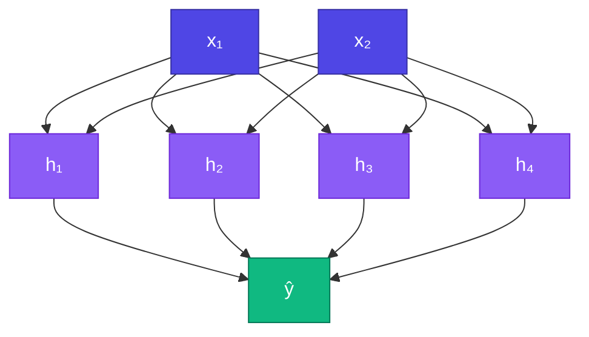

# 🏗️ MLP (Multi-Layer Perceptron)

<ConceptAnim name="llm-pipeline" caption="Multi-layer perceptron" />

<Callout type="idea">
💡 **MLP** = multiple layer stack। Hidden layers non-linear transform করে — XOR, image classification, language modeling-এর ancestor।
</Callout>

## Architecture

```
Input → [Hidden Layer 1] → [Hidden Layer 2] → Output
  (n)        (h1)               (h2)            (out)
```


## Why Multiple Layers?

Single layer = linear boundary only (perceptron limitation)।

Two+ layers with activation = **non-linear decision boundaries** — can solve XOR, spirals, complex patterns।

<StepReveal steps={[
  { emoji: "📥", title: "Input layer", body: "Raw features (e.g. 2D point)" },
  { emoji: "🧠", title: "Hidden layers", body: "Learn intermediate representations" },
  { emoji: "📤", title: "Output layer", body: "Final prediction (class logits)" },
  { emoji: "🔄", title: "Forward chain", body: "Each layer feeds the next" }
]} />

## MLP Class

## Example: 2 → 4 → 1 MLP

XOR problem-এর জন্য typical architecture:

```
Input:  2 neurons (x₁, x₂)
Hidden: 4 neurons (ReLU)
Output: 1 neuron (sigmoid → 0 or 1)
```



## Training an MLP

## MLP vs GPT

| | MLP | GPT |
|---|-----|-----|
| Layers | Fully connected | Transformer blocks |
| Input | Fixed-size vector | Variable-length sequence |
| Context | None | Attention over all tokens |
| Same idea? | Stack layers + train with GD | ✓ (much more complex) |

## Interactive Demo

<Playground id="part-05/mlp" title="Multi-Layer Perceptron" />

## ✅ তুমি কী শিখলে?

- **MLP** = stack of Layer objects
- Hidden layers learn non-linear features
- Architecture defined by size array: `[nIn, h1, h2, nOut]`
- `forward()` chains layers, `parameters()` collects all weights
- Foundation architecture — XOR next!

**আগের lesson:** [Layer](/docs/part-05-neural-network/02-layer)

**পরের lesson:** [Train XOR](/docs/part-05-neural-network/04-xor)
