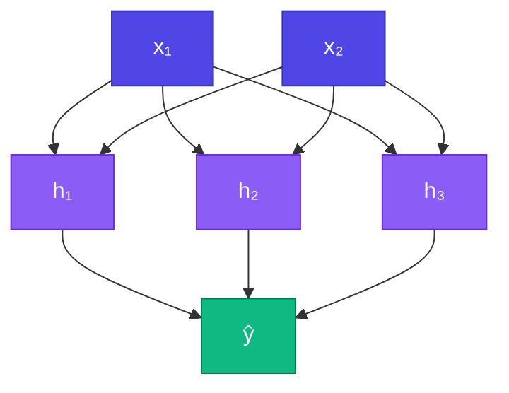

# MLP (Multi-Layer Perceptron)

<ConceptAnim slug="part-05-neural-network/03-mlp" />

<Callout type="idea">
**MLP** = multiple Layer stack। Hidden layers non-linear transform করে — XOR, image classification, এমনকি language modeling-এর ancestor।
</Callout>

একটা Layer একটা transform দেয়। কিন্তু জটিল pattern শিখতে হলে transform-এর পর transform লাগে — সেটাই **MLP**। Layer-গুলোকে সারি দিয়ে সাজালেই তৈরি।

## Architecture দেখো

```
Input → [Hidden Layer 1] → [Hidden Layer 2] → Output
  (n)        (h1)               (h2)            (out)
```


প্রতিটা Layer আগেরটার output নেয়, নতুন representation বানায়, পরেরটাকে দেয়।

## Multiple Layers কেন?

Single Layer = শুধু linear boundary (perceptron limitation)। একটা সরল রেখা দিয়ে সব কিছু আলাদা করা যায় না।

Two+ layers with activation = **non-linear decision boundaries** — XOR, spiral, জটিল pattern — এগুলো solve করা যায়। Activation ছাড়া অবশ্য গভীর নেটওয়ার্কও আবার linear হয়ে যায়; তাই ReLU/Sigmoid দরকার।

<StepReveal steps={[
  { emoji: "📥", title: "Input layer", body: "Raw feature (যেমন 2D point)" },
  { emoji: "🧠", title: "Hidden layers", body: "মধ্যবর্তী representation শেখে" },
  { emoji: "📤", title: "Output layer", body: "Final prediction (class logits)" },
  { emoji: "🔄", title: "Forward chain", body: "প্রতিটা layer পরেরটাকে feed করে" }
]} />

## উদাহরণ: 2 → 3 → 1 MLP (demo)

Layer stack — নীচের Playground-এ `[nIn, h1, nOut]` architecture দিয়ে MLP forward দেখো।

```
Input:  2 neurons
Hidden: 3 neurons (sigmoid)
Output: 1 neuron (sigmoid)
```

পরের XOR lesson-এ আমরা **2 → 4 → 1** train করব — একটু বেশি hidden unit, যাতে decision boundary নমনীয় হয়।



## MLP Train করা

Forward → loss → Backprop → weight update — পুরো loop নীচের Playground ও পরের XOR lesson-এ দেখবে। Module 4-এর Autograd এখানেই কাজে লাগে: প্রতিটা weight `Value`, তাই `.backward()` এক কলেই সব grad পাও।

## MLP vs GPT — তুলনা

MLP আর GPT এক নয় — কিন্তু মূল idea মিলে যায়:

| | MLP | GPT |
|---|-----|-----|
| Layers | Fully connected | Transformer blocks |
| Input | Fixed-size vector | Variable-length sequence |
| Context | None | Attention over all tokens |
| Same idea? | Stack layers + train with GD | ✓ (much more complex) |

মানে: stack করো, train করো, loss কমাও — বাকি architecture-এর খেলা।

## কোড চেষ্টা করো

<Playground id="part-05/mlp" title="Multi-Layer Perceptron" />

## তুমি কী শিখলে?

- **MLP** = কয়েকটা Layer একটার পর একটা stack করা
- Hidden layer non-linear feature শেখে
- Demo architecture: `2 → 3 → 1` forward pass
- পরের lesson: XOR-এ `2 → 4 → 1` train করব

**আগের lesson:** [Layer](/docs/part-05-neural-network/02-layer)

**পরের lesson:** [Train XOR](/docs/part-05-neural-network/04-xor)
