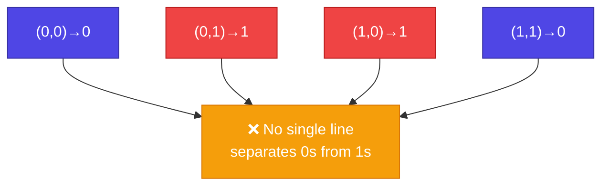
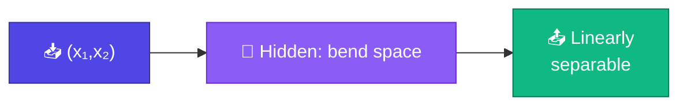
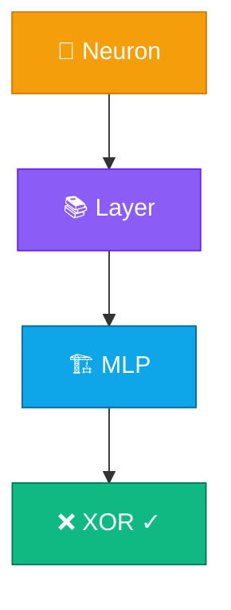

# XOR Train করা

<ConceptAnim slug="part-05-neural-network/04-xor" />

<Callout type="idea">
**XOR** = classic test — single Neuron/Layer দিয়ে solve করা যায় না। 2-layer MLP + Gradient Descent = প্রথম “ম্যাজিক” মুহূর্ত!
</Callout>

সবকিছু জোড়া লেগেছে: Neuron, Layer, MLP, Autograd। এখন একটা সত্যিকারের সমস্যায় apply করি — **XOR**। এটা ছোট, কিন্তু ইতিহাসে বড় জায়গা দখল করে আছে।

## XOR-এর Truth Table

| x₁ | x₂ | XOR |
|----|----|----|
| 0 | 0 | **0** |
| 0 | 1 | **1** |
| 1 | 0 | **1** |
| 1 | 1 | **0** |

দেখো: একই ধরনের input-এ আলাদা output। Linear boundary দিয়ে ০ আর ১ আলাদা করা **অসম্ভব** — একটা সরল রেখা দিয়ে এই চারটা বিন্দু ভাগ করা যায় না।



## Single Layer কেন Fail করে

Single Neuron output:

```
y = activation(w₁x₁ + w₂x₂ + b)
```

এটা একটা **straight line** (Sigmoid থাকলেও মূলত একটা boundary) — XOR-এর জন্য **দুইটা অঞ্চল** লাগে, একটা half-plane নয়।

১৯৬৯-এ Minsky & Papert এটা proof করেছিল — এটাই “AI winter”-এর একটা কারণ। Hidden layer দিয়ে সমাধান এল **১৯৮৬-এর Backprop revival**-এ। আমরা এখন সেই সমাধানটাই scratch থেকে চালাব।

## সমাধান: MLP [2, 4, 1]

```
Input (2) → Hidden (4, ReLU) → Output (1, Sigmoid)
```

চারটা hidden unit input space-কে বাঁকিয়ে দেয়; তারপর output layer সহজে আলাদা করতে পারে।

<StepReveal steps={[
  { emoji: "📊", title: "4 training points", body: "XOR truth table as dataset" },
  { emoji: "➡️", title: "Forward pass", body: "MLP predicts ŷ for each (x₁, x₂)" },
  { emoji: "📉", title: "MSE loss", body: "Σ(ŷ - target)² / 4" },
  { emoji: "🔄", title: "~100 epochs GD", body: "Loss → 0, predictions correct" }
]} />

## Loss Function কী

Prediction আর target-এর দূরত্ব মাপতে **MSE** ব্যবহার করব — ছোট dataset-এ সহজ আর পরিষ্কার।

<MathLesson title="Mean Squared Error (MSE)">
  <MathIntuition>
    Prediction target-এর কাছাকাছি হলে loss কম। Squared error বড় ভুলকে বেশি শাস্তি দেয় — তাই model দ্রুত ঠিক পথে আসে।
  </MathIntuition>
  <SymbolTable symbols={[
    { sym: "ŷ", meaning: "model prediction" },
    { sym: "y", meaning: "true target (0 বা 1)" },
    { sym: "n", meaning: "training example সংখ্যা (XOR-এ 4)" }
  ]} />
  <Formula>
    {`$$L = \\frac{1}{n} \\sum_{i=1}^{n} (\\hat{y}_i - y_i)^2$$`}
  </Formula>
  <WorkedExample>
    Predictions after training:{'\n'}
    (0,0)→0.01, (0,1)→0.98, (1,0)→0.97, (1,1)→0.02{'\n'}
    All correct! Loss ≈ 0.0001
  </WorkedExample>
  <CodeLink>Playground-এ XOR training run করো ↓</CodeLink>
</MathLesson>

## Decision Boundary

Training শেষে hidden layer non-linear boundary তৈরি করে। সহজ করে বললে: hidden layer জ্যামিতি বদলে দেয়, যাতে output layer একটা সরল কাট দিয়েই কাজ সারতে পারে।



Hidden layer input space-কে **transform** করে যেখানে output layer linearly separate করতে পারে। এটাই deep learning-এর মূল কৌশল — representation শেখা।

## Training Code-এর Sketch

Epoch loop-এ loss কমে — নীচের Playground-এ XOR train করে curve দেখো। Forward → MSE → Backprop → Gradient Descent; Module 4-এর পুরো engine এখানেই কাজে লাগে।

## Training-এ Loss

<LossChart
  data={[0.65, 0.45, 0.22, 0.08, 0.02, 0.001]}
  title="XOR Training Loss"
/>

## Module 5 শেষ!



তুমি **neural network** বানিয়ে **train** করলে! পরের Module-এ এটাকে **language model**-এ apply করব — word embedding দিয়ে next-token prediction।

## কোড চেষ্টা করো

<Playground id="part-05/xor" title="XOR Training" />

## তুমি কী শিখলে?

- **XOR** single-layer linear classifier দিয়ে solve হয় না
- **2-layer MLP** hidden unit দিয়ে non-linear transform করে solve করে
- Training = forward → MSE loss → Backprop → Gradient Descent
- Loss ~100 epoch-এ প্রায় ০-এ নেমে আসে
- একই training loop GPT স্কেলেও চলে (শুধু parameter অনেক বেশি)

**আগের lesson:** [MLP](/docs/part-05-neural-network/03-mlp)

**পরের Module:** [Module 6 — Neural Language Model](/docs/part-06-neural-lm)
