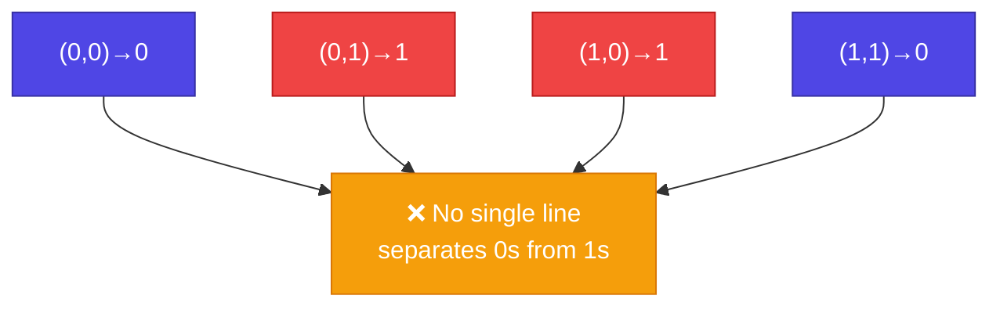
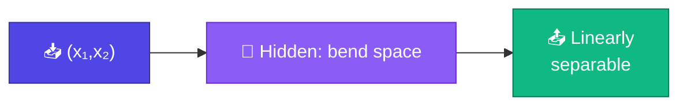
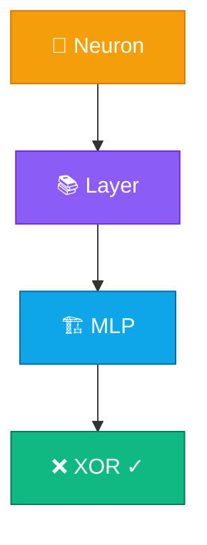

# ❌ Train XOR

<ConceptAnim slug="part-05-neural-network/04-xor" />

<Callout type="idea">
💡 **XOR** = classic test — single neuron/layer solve করতে পারে না। 2-layer MLP + gradient descent = first "magic" moment!
</Callout>

## XOR Truth Table

| x₁ | x₂ | XOR |
|----|----|----|
| 0 | 0 | **0** |
| 0 | 1 | **1** |
| 1 | 0 | **1** |
| 1 | 1 | **0** |

Same input → different output। Linear boundary দিয়ে separate করা **impossible**।



## Why Single Layer Fails

Single neuron output:

```
y = activation(w₁x₁ + w₂x₂ + b)
```

এটা একটা **straight line** (or curve if sigmoid, but still one boundary) — XOR needs **two regions**, not one half-plane.

1969-এ Minsky & Papert proof করেছিল — এটাই "AI winter"-এর একটা কারণ ছিল। Hidden layer solution: **1986 backprop revival**।

## Our Solution: MLP [2, 4, 1]

```
Input (2) → Hidden (4, ReLU) → Output (1, Sigmoid)
```

<StepReveal steps={[
  { emoji: "📊", title: "4 training points", body: "XOR truth table as dataset" },
  { emoji: "➡️", title: "Forward pass", body: "MLP predicts ŷ for each (x₁, x₂)" },
  { emoji: "📉", title: "MSE loss", body: "Σ(ŷ - target)² / 4" },
  { emoji: "🔄", title: "~100 epochs GD", body: "Loss → 0, predictions correct" }
]} />

## Loss Function

<MathLesson title="Mean Squared Error (MSE)">
  <MathIntuition>
    Prediction target-এর কাছাকাছি হলে loss কম — squared error penalizes big mistakes more।
  </MathIntuition>
  <SymbolTable symbols={[
    { sym: "ŷ", meaning: "model prediction" },
    { sym: "y", meaning: "true target (0 or 1)" },
    { sym: "n", meaning: "number of training examples (4 for XOR)" }
  ]} />
  <Formula>
    {`$$L = \\frac{1}{n} \\sum_{i=1}^{n} (\\hat{y}_i - y_i)^2$$`}
  </Formula>
  <WorkedExample>
    Predictions after training:{'\n'}
    (0,0)→0.01, (0,1)→0.98, (1,0)→0.97, (1,1)→0.02{'\n'}
    All correct! Loss ≈ 0.0001
  </WorkedExample>
  <CodeLink>Playground-এ XOR training run করো ↓</CodeLink>
</MathLesson>

## Decision Boundary

Training শেষে hidden layer non-linear boundary তৈরি করে:



Hidden layer input space-কে **transform** করে যেখানে output layer linearly separate করতে পারে।

## Training Code Sketch

## Loss During Training

<LossChart
  data={[0.65, 0.45, 0.22, 0.08, 0.02, 0.001]}
  title="XOR Training Loss"
/>

## Module 5 Complete!



🎉 তুমি **neural network** বানিয়ে **train** করলে! পরের Module-এ এটাকে **language model**-এ apply করব।

## Interactive Demo

<Playground id="part-05/xor" title="XOR Training" />

## ✅ তুমি কী শিখলে?

- **XOR** cannot be solved by single-layer linear classifier
- **2-layer MLP** with hidden units solves it via non-linear transform
- Training = forward → MSE loss → backprop → gradient descent
- Loss decreases to ~0 over ~100 epochs
- Same training loop scales to GPT (billions of params)

**আগের lesson:** [MLP](/docs/part-05-neural-network/03-mlp)

**পরের Module:** [Module 6 — Neural Language Model](/docs/part-06-neural-lm) *(coming soon)*
