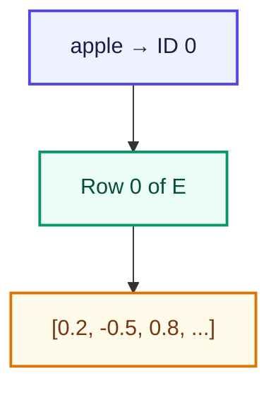

# Embedding — Word থেকে Vector

<ConceptAnim slug="part-06-neural-lm/01-embedding" />

Module 2-এর count table মনে আছে? `like → { apple: 2, banana: 1, mango: 1 }` — শুধু সংখ্যা রাখত। Neural LM-এ আমরা সেটার **smart version** ব্যবহার করি: **Embedding**।

<Callout type="idea">
**Embedding** মানে: প্রতিটা word/token-এর জন্য একটা **learned vector**। Lookup করে vector পাও → training-এ similar word-গুলো space-এ কাছাকাছি হয়ে যায় (উপরের ৩D animation)।
</Callout>

সহজ করে বললে: প্রতিটা word-কে একটা সংখ্যার তালিকা (vector) দিয়ে represent করি। শুরুতে random; training চললে vector-গুলো meaningful হয়ে যায় — `apple` আর `mango` কাছাকাছি, `like` আলাদা জায়গায়।

এই vectors রাখে **embedding matrix** `E`:

$$E \in \mathbb{R}^{V \times D}$$

- `V` = vocabulary size (কতটা unique word)
- `D` = embedding dimension (প্রতিটা vector-এর length)



## Lookup মানে Matrix Row

Token ID দিয়ে embedding matrix-এর **একটা row** pick করা — এটাই lookup। কোনো জটিল হিসাব নেই; dictionary-তে key দিয়ে value নেওয়ার মতো।

**Example:** Vocabulary = 5 words, D = 4

```
ID 0 ("i")     → [0.1,  0.3, -0.2,  0.5]
ID 1 ("like")  → [0.4, -0.1,  0.6,  0.2]
ID 2 ("apple") → [0.7,  0.2, -0.3,  0.1]
```

## Count Table vs Embedding — তফাত

| | Bigram Count | Embedding |
|---|-------------|-----------|
| Storage | Sparse counts | Dense vectors |
| Similarity | None | Learned |
| Update | Count +1 | Gradient descent |

Count table শুধু “কতবার দেখেছি” মনে রাখে। Embedding similarityও শেখে — training-এ gradient descent দিয়ে।

<StepReveal steps={[
  { emoji: "1️⃣", title: "Token → ID", body: "Vocabulary থেকে integer index" },
  { emoji: "2️⃣", title: "ID → Row", body: "Embedding matrix E[tokenId]" },
  { emoji: "3️⃣", title: "Vector out", body: "D-dimensional representation" }
]} />

## কোড চেষ্টা করো

Token ID দিয়ে embedding row pick — নীচের snippet চালাও, তারপর Playground-এ experiment করো।

<CodeRun title="Embedding lookup" height={220}>{`// Embedding matrix E — প্রতিটা row একটা word vector
const words = ['i', 'like', 'apple'];
const E = [
  [0.1, 0.3, -0.2, 0.5],
  [0.4, -0.1, 0.6, 0.2],
  [0.7, 0.2, -0.3, 0.1],
];

const id = 1; // "like"
log.step('Embedding lookup');
log.data('Token', words[id]);
log.data('ID', id);
log.data('Vector E[id]', E[id]);
log.ok('row pick সম্পন্ন');`}</CodeRun>

<Playground id="part-06/embedding" title="Embedding Lookup" />

## তুমি কী শিখলে?

- **Embedding matrix** = শেখা word representation-এর table
- Lookup = token ID দিয়ে একটা row pick করা
- Similar words → similar vectors (training-এ শেখে)

**পরের lesson:** [Weight Matrix](/docs/part-06-neural-lm/02-weight-matrix)
