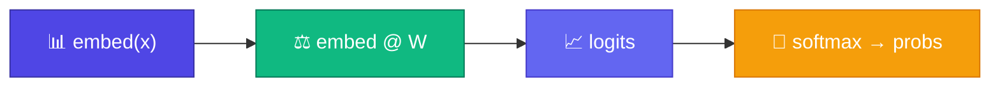

# Weight Matrix — Logits বের করা

<ConceptAnim slug="part-06-neural-lm/02-weight-matrix" />

Embedding দিয়ে word-কে vector বানালাম — এখন সেই vector দিয়ে **পরের token predict** করতে হবে। এখানেই আসে Weight Matrix `W`।

Module 3-এ Softmax দেখেছ — raw logits থেকে probability। আর Module 3-এর matmul মনে রাখো: `embed @ W` মানেই vector × matrix। সেই একই হিসাব এখানে next-token logits দেয়।

<Callout type="warn">
এটা essentially **neural bigram**: current token-এর Embedding দেখে পরের token guess। Context window এখনো 1 — Attention পরে Module 7-এ আসবে।
</Callout>



## Shape

$$W \in \mathbb{R}^{D \times V}$$

- Input: embedding vector shape `(D,)`
- Output: logits shape `(V,)` — প্রতিটা vocabulary word-এর জন্য একটা score

`D` ছোট (embedding dim), `V` বড় (vocabulary) — তাই output-এ প্রতিটা possible next word-এর একটা score পাও।

## Example Walkthrough

Vocabulary = 3 words, D = 2:

```
embed("like") = [0.4, -0.1]

W = [[0.5, 0.2, -0.3],
     [0.1, 0.8,  0.4]]

logits = embed @ W = [0.19, 0.0, -0.16]
probs  = softmax(logits) ≈ [0.40, 0.33, 0.28]
```

দেখো — count table নেই; learned `W` দিয়েই probability বের হলো।

## Softmax = Probability

Raw logits negative/positive যেকোনো হতে পারে। **Softmax** সব positive probability-তে convert করে (sum = 1):

$$\text{softmax}(z_i) = \frac{e^{z_i}}{\sum_j e^{z_j}}$$

এই probs দিয়েই আমরা sample করব (generation-এ) — আর training-এ সঠিক token-এর probability দিয়ে Loss হিসাব করব।

## কোড চেষ্টা করো

<Playground id="part-06/weight-matrix" title="Weight Matrix Forward Pass" />

## তুমি কী শিখলে?

- **W** maps Embedding → logits over vocabulary
- Forward pass = embed → matmul → Softmax
- Neural bigram = learned weights, not counts

**পরের lesson:** [Cross-Entropy Loss](/docs/part-06-neural-lm/03-loss)
