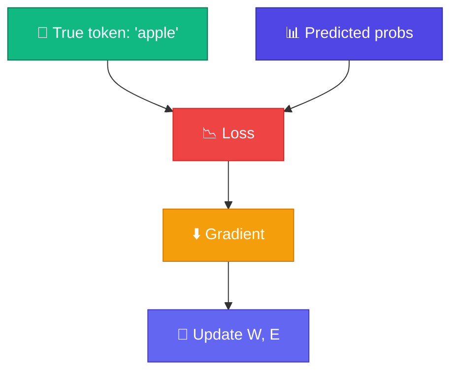

# Cross-Entropy Loss — ভুল মাপা

<ConceptAnim slug="part-06-neural-lm/03-loss" />

Forward pass দিয়ে Softmax probability পেলাম — কিন্তু model **কতটা ভুল**? সেই answer দেয় Loss function। Language model-এ standard choice: **cross-entropy loss**।

<Callout type="idea">
Loss **কম** = model ভালো predict করছে। Training-এর goal: Loss minimize করা।
</Callout>

সহজ intuition: সঠিক token-কে যদি model ৯০% probability দেয়, Loss ছোট। যদি ১০% দেয় — মানে ভুলের দিকে confident — Loss অনেক বড়। এই signal দিয়েই আমরা weights ঠিক করি।

<MathLesson title="Cross-Entropy Loss">
  <MathIntuition>
    Model সঠিক token-কে **উচ্চ probability** দিলে Loss কম। ভুল token-কে বেশি probability দিলে Loss বেশি — log দিয়ে penalty exponential হয়।
  </MathIntuition>
  <SymbolTable symbols={[
    { sym: "L", meaning: "Loss (scalar — একটা number)" },
    { sym: "y", meaning: "True next token-এর ID" },
    { sym: "p_i", meaning: "Model-এর i-th token-এর predicted probability" },
    { sym: "V", meaning: "Vocabulary size" }
  ]} />
  <Formula>
    {`$$L = -\\log p_y = -\\log \\text{softmax}(\\text{logits})_y$$`}
  </Formula>
  <MathPractical title="গণনা দেখো (ধাপে ধাপে)">
    
১. সঠিক token = <code>"apple"</code> (ID = 2)

    
২. Model probs: <code>[0.1, 0.2, 0.5, 0.2]</code> → সঠিকটার p = 0.5

    
৩. Loss: <code>L = −log(0.5) ≈ 0.693</code>

    
৪. যদি confident হত (p = 0.9): <code>L = −log(0.9) ≈ 0.105</code> — অনেক কম

    
৫. যদি ভুল হত (p = 0.1): <code>L = −log(0.1) ≈ 2.303</code> — অনেক বেশি

  </MathPractical>
  <CodeLink>Playground-এ Loss calculate করো ↓</CodeLink>
</MathLesson>

## Intuition

| Predicted P(correct) | Loss |
|---------------------|------|
| 0.9 (confident) | 0.11 |
| 0.5 (unsure) | 0.69 |
| 0.1 (wrong) | 2.30 |

Loss **exponentially** বাড়ে যখন model confident ভুল হয় — তাই training এটাকে hard punish করে।

## Training Signal

Loss থেকে **gradient** বের করে weights update করি:

$$W \leftarrow W - \eta \cdot \frac{\partial L}{\partial W}$$

এটা Module 4-এ শেখা autograd + gradient descent-এর application — শুধু এখন Loss = cross-entropy, আর parameters = Embedding `E` + Weight Matrix `W`।

## কোড চেষ্টা করো

<Playground id="part-06/loss" title="Cross-Entropy Loss Calculator" />

## তুমি কী শিখলে?

- **Cross-entropy** = `-log P(correct token)`
- Lower Loss = better predictions
- Loss drives weight updates via backprop

**পরের lesson:** [Training Loop](/docs/part-06-neural-lm/04-train)
