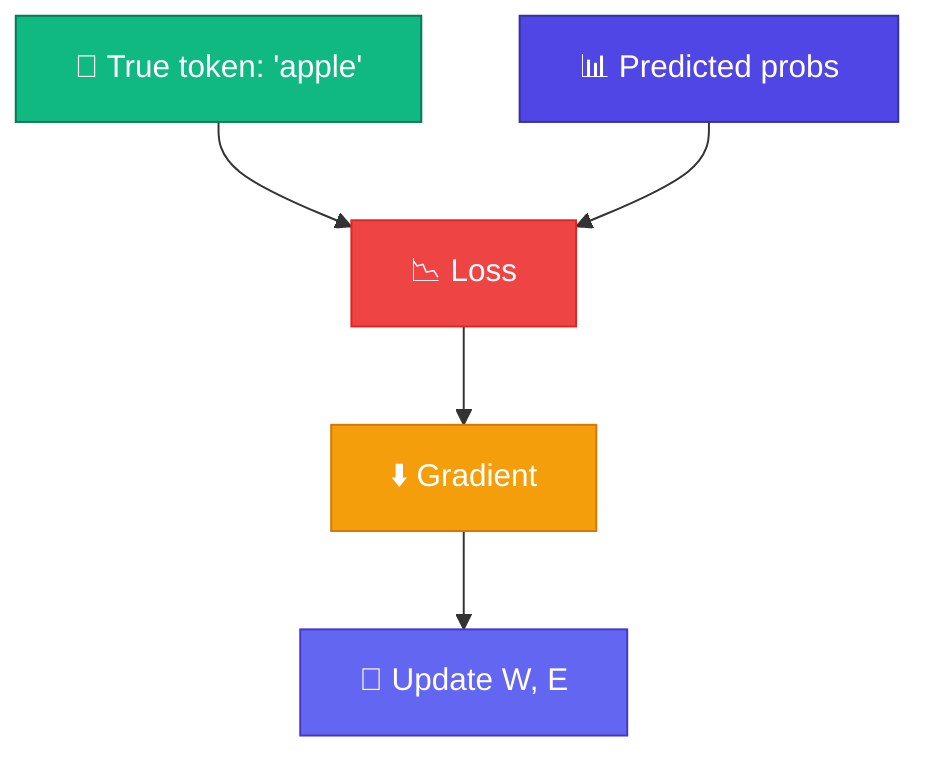

# 📉 Cross-Entropy Loss

<ConceptAnim name="softmax-bars" caption="Cross-entropy loss" />

Model prediction দিল — কিন্তু **কতটা ভুল**? Loss function এই answer দেয়। Language model-এ standard choice: **cross-entropy loss**।

<Callout type="idea">
💡 Loss **কম** = model ভালো predict করছে। Training-এর goal: loss minimize করা।
</Callout>

<MathLesson title="Cross-Entropy Loss">
  <MathIntuition>
    Model সঠিক token-কে **উচ্চ probability** দিলে loss কম। ভুল token-কে বেশি probability দিলে loss বেশি — log দিয়ে penalty exponential হয়।
  </MathIntuition>
  <SymbolTable symbols={[
    { sym: "L", meaning: "Loss (scalar — একটা number)" },
    { sym: "y", meaning: "True next token-এর ID" },
    { sym: "p_i", meaning: "Model-এর i-th token-এর predicted probability" },
    { sym: "V", meaning: "Vocabulary size" }
  ]} />
  <Formula>
    {`$$L = -\\log p_y = -\\log \\text{softmax}(\\text{logits})_y$$`}
  </Formula>
  <WorkedExample>
    True token = "apple" (ID 2){'\n'}
    probs = [0.1, 0.2, 0.5, 0.2]{'\n'}
    L = -log(0.5) ≈ 0.693{'\n\n'}
    যদি model confident হত (p=0.9): L = -log(0.9) ≈ 0.105
  </WorkedExample>
  <CodeLink>Playground-এ loss calculate করো ↓</CodeLink>
</MathLesson>

## Intuition

| Predicted P(correct) | Loss |
|---------------------|------|
| 0.9 (confident) | 0.11 |
| 0.5 (unsure) | 0.69 |
| 0.1 (wrong) | 2.30 |

Loss **exponentially** বাড়ে যখন model confident ভুল হয়।

## Training Signal

Loss থেকে **gradient** বের করে weights update করি:

$$W \leftarrow W - \eta \cdot \frac{\partial L}{\partial W}$$

এটা Module 4-এ শেখা autograd + gradient descent-এর application।

## Interactive Demo

<Playground id="part-06/loss" title="Cross-Entropy Loss Calculator" />

## ✅ তুমি কী শিখলে?

- **Cross-entropy** = `-log P(correct token)`
- Lower loss = better predictions
- Loss drives weight updates via backprop

**পরের lesson:** [Training Loop](/docs/part-06-neural-lm/04-train)
