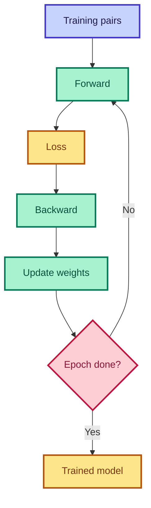

# Training Loop

<ConceptAnim slug="part-06-neural-lm/04-train" />

Embedding, weight matrix, loss — সব ready।

<Callout type="tip">
✅ Typical neural LM training: **200 epochs** fruit dataset-এ। Loss gradually কমতে থাকবে।
</Callout>

## Loop Structure

<StepReveal steps={[
  { emoji: "1️⃣", title: "Forward", body: "Input token → logits → loss" },
  { emoji: "2️⃣", title: "Backward", body: "Gradient compute (autograd)" },
  { emoji: "3️⃣", title: "Update", body: "W, E -= lr × gradient" },
  { emoji: "4️⃣", title: "Repeat", body: "200 epochs until loss drops" }
]} />

## Loss Curve

Training চলাকালীন loss কমতে থাকে:

<LossChart data={[2.5, 1.8, 1.2, 0.9, 0.7]} title="Neural LM Training Loss" />

<Callout type="warn">
⚠️ Loss 0 হবে না — overfitting warning! Real model-এ validation loss monitor করো।
</Callout>

## Hyperparameters

| Param | Typical | Meaning |
|-------|---------|---------|
| `lr` | 0.01–0.1 | Learning rate |
| `epochs` | 200 | Full dataset passes |
| `D` | 16–64 | Embedding dimension |

## কোড চেষ্টা করো

<Playground id="part-06/train" title="200-Epoch Training Loop" viz="loss" />

## ✅ তুমি কী শিখলে?

- Training = repeat forward → loss → backward → update
- Loss curve should **decrease** over epochs
- 200 epochs ≈ enough for small fruit dataset

**পরের lesson:** [Generate](/docs/part-06-neural-lm/05-generate)
