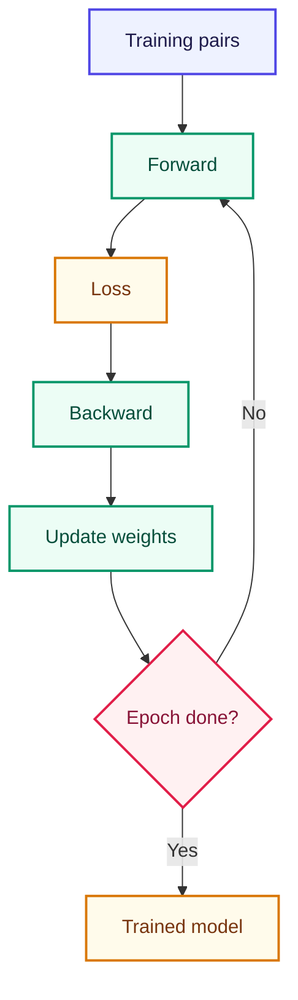

# Training Loop — Model শেখানো

<ConceptAnim slug="part-06-neural-lm/04-train" />

Embedding, Weight Matrix, Loss — তিনটে piece ready। এখন সেগুলো একটা **loop**-এ বসাব: বারবার forward → Loss → backward → update। Module 4–5-এর training idea এখানে language model-এ apply হচ্ছে।

<Callout type="tip">
Browser demo-তে **~200 epochs** fruit word pairs-এ train করি। Loss gradually কমতে থাকবে — Run চাপলে live chart-এ দেখবে।
</Callout>

Training pairs Module 1-এর মতোই: `(like, apple)`, `(like, banana)`… Forward-এ current token দিয়ে Softmax probs, Loss-এ true next token মাপা, তারপর gradient দিয়ে `E` আর `W` আপডেট।

## Loop Structure

<StepReveal steps={[
  { emoji: "1️⃣", title: "Forward", body: "Input token → logits → Loss" },
  { emoji: "2️⃣", title: "Backward", body: "Gradient compute (dW from Softmax error)" },
  { emoji: "3️⃣", title: "Update", body: "W -= lr × gradient" },
  { emoji: "4️⃣", title: "Repeat", body: "~200 epochs until Loss drops" }
]} />

## Loss Curve

Training চলাকালীন Loss কমতে থাকে — এটাই দেখে বোঝা যায় model শিখছে:

<LossChart data={[2.5, 1.8, 1.2, 0.9, 0.7]} title="Neural LM Training Loss" />

<Callout type="warn">
Loss 0 হবে না — আর হওয়া উচিতও নয় (overfitting warning)। Real model-এ validation Loss monitor করো।
</Callout>

## Hyperparameters

| Param | Demo value | Meaning |
|-------|------------|---------|
| `lr` | 3 | Learning rate (toy scale) |
| `epochs` | 200 | Full dataset passes |
| Dataset | 10 fruit sentences | Module 1 corpus |

Toy dataset-এ `lr = 3` ঠিক আছে; বড় model-এ learning rate অনেক ছোট হয়। Idea একই — ধাপে ধাপে Loss নামানো।

## কোড চেষ্টা করো

<Playground id="part-06/train" title="Fruit Neural LM Training" viz="loss" />

## তুমি কী শিখলে?

- Training = repeat forward → Loss → backward → update
- Loss curve should **decrease** over epochs
- Same fruit words as Bigram — এখন learned weights

**পরের lesson:** [Generate](/docs/part-06-neural-lm/05-generate)
