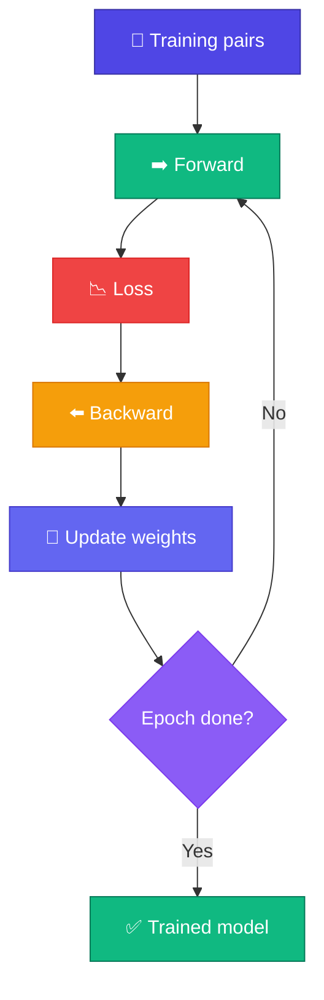

# 🔄 Training Loop

<ConceptAnim name="train-loop" caption="Forward → Loss → Backward → Update — loop until loss drops" />

Embedding, weight matrix, loss — সব ready।

<Callout type="tip">
✅ Browser demo-তে **~80 epochs** fruit word pairs-এ train করি। Loss gradually কমতে থাকবে — Run চাপলে live chart-এ দেখবে।
</Callout>

## Loop Structure

<StepReveal steps={[
  { emoji: "1️⃣", title: "Forward", body: "Input token → logits → loss" },
  { emoji: "2️⃣", title: "Backward", body: "Gradient compute (dW from softmax error)" },
  { emoji: "3️⃣", title: "Update", body: "W -= lr × gradient" },
  { emoji: "4️⃣", title: "Repeat", body: "~80 epochs until loss drops" }
]} />

## Loss Curve

Training চলাকালীন loss কমতে থাকে:

<LossChart data={[2.5, 1.8, 1.2, 0.9, 0.7]} title="Neural LM Training Loss" />

<Callout type="warn">
⚠️ Loss 0 হবে না — overfitting warning! Real model-এ validation loss monitor করো।
</Callout>

## Hyperparameters

| Param | Demo value | Meaning |
|-------|------------|---------|
| `lr` | 3 | Learning rate (toy scale) |
| `epochs` | 80 | Full dataset passes |
| Dataset | 10 fruit sentences | Module 1 corpus |

## Interactive Demo

<Playground id="part-06/train" title="Fruit Neural LM Training" viz="loss" />

## ✅ তুমি কী শিখলে?

- Training = repeat forward → loss → backward → update
- Loss curve should **decrease** over epochs
- Same fruit words as Bigram — এখন learned weights

**পরের lesson:** [Generate](/docs/part-06-neural-lm/05-generate)
