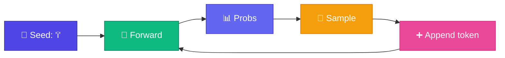

# 🎲 Generate from Neural LM

<ConceptAnim slug="part-06-neural-lm/05-generate" />

Training শেষ — এখন trained neural LM দিয়ে **text generate** করব। Process Bigram generation-এর মতোই: autoregressive loop।

<Callout type="idea">
💡 Generation = trained model-এর probability distribution থেকে **sample** করে next token pick করা।
</Callout>



## Generation Loop

<StepReveal steps={[
  { emoji: "1️⃣", title: "Seed token", body: "'i' দিয়ে শুরু" },
  { emoji: "2️⃣", title: "Forward pass", body: "Neural LM → probability distribution" },
  { emoji: "3️⃣", title: "Sample", body: "Distribution থেকে random pick" },
  { emoji: "4️⃣", title: "Repeat", body: "'i like apple is fruit...'" }
]} />

## Neural vs Bigram Generation

| | Bigram | Neural LM |
|---|--------|-----------|
| Memory | Count table | Learned E + W |
| Quality | Limited patterns | Richer (same context window) |
| Sampling | Same idea | Same idea |

## Example Output

```
Seed: "i"
→ i like apple
→ i like apple is fruit
→ i like mango is fruit
```

Output **random** — same seed + different sample = different text!

## কোড চেষ্টা করো

<Playground id="part-06/generate" title="Neural LM Text Generation" />

## ✅ তুমি কী শিখলে?

- Trained neural LM generates via autoregressive sampling
- Same loop as Bigram — but learned weights instead of counts
- Module 6 complete — next: **Attention** for longer context!

**পরের Module:** [Module 7 — Attention](/docs/part-07-attention)
