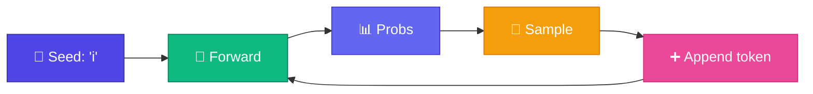

# Generate — Trained Model দিয়ে লেখা

<ConceptAnim slug="part-06-neural-lm/05-generate" />

Training শেষ — `E` আর `W` এখন pattern জানে। এবার সেই trained Neural LM দিয়ে **text generate** করব। Process Module 2-এর Bigram generation-এর মতোই: **autoregressive** loop — predict → append → আবার predict।

<Callout type="idea">
Generation = trained model-এর probability distribution থেকে **sample** করে next token pick করা।
</Callout>

Module 0-এ যে next-token prediction দেখেছিলে — এখন সেটা learned weights দিয়ে চলছে। Count table নেই; Softmax probs থেকে sample।



## Generation Loop কীভাবে চলে

<StepReveal steps={[
  { emoji: "1️⃣", title: "Seed token", body: "'i' দিয়ে শুরু" },
  { emoji: "2️⃣", title: "Forward pass", body: "Neural LM → probability distribution" },
  { emoji: "3️⃣", title: "Sample", body: "Distribution থেকে random pick" },
  { emoji: "4️⃣", title: "Repeat", body: "'i like apple is fruit...'" }
]} />

## Neural vs Bigram Generation — তফাত

| | Bigram | Neural LM |
|---|--------|-----------|
| Memory | Count table | Learned E + W |
| Quality | Limited patterns | Richer (same context window) |
| Sampling | Same idea | Same idea |

মনে রাখো: context window এখনো **১টা token**। তাই quality Bigram-এর কাছাকাছি থাকতে পারে — কিন্তু architecture এখন neural, তাই পরে Attention যোগ করে context বাড়ানো যাবে।

## উদাহরণ Output

```
Seed: "i"
→ i like apple
→ i like apple is fruit
→ i like mango is fruit
```

Output **random** — same seed + different sample = different text! Module 2-এর sampling vs argmax lesson-এর same idea।

## কোড চেষ্টা করো

<Playground id="part-06/generate" title="Neural LM Text Generation" />

## তুমি কী শিখলে?

- Train করা Neural LM **autoregressive sampling** দিয়ে generate করে
- Loop Bigram-এর মতোই — শুধু count-এর জায়গায় learned weights
- Module 6 শেষ — পরের ধাপ: লম্বা context-এর জন্য **Attention**!

**পরের Module:** [Module 7 — Attention](/docs/part-07-attention)
