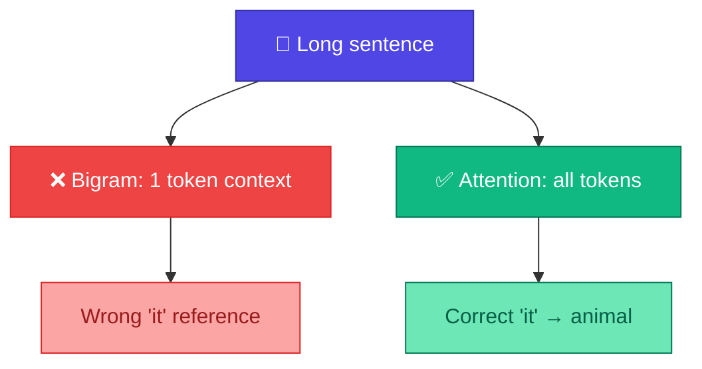

# Attention কেন লাগে?

<ConceptAnim slug="part-07-attention/01-why-attention" />

Bigram আর Module 6-এর Neural LM দুটোই শুধু **একটা আগের token** দেখে। ছোট fruit sentence-এ চলে যায় — কিন্তু real language-এ context অনেক বড়।

<Callout type="warn">
`"The animal didn't cross the road because it was tired."` — `"it"` কার দিকে point করে? `animal` নাকি `road`?
</Callout>

মানুষ সহজে বলে `animal`। Model-কেও সেটা বুঝতে হলে `"it"`-এর আগের পুরো sentence দেখতে হবে — শুধু `"because"` নয়। এটাই **long-range dependency** problem।



## The Problem: Fixed Context Window

| Model | Context | Limitation |
|-------|---------|------------|
| Bigram | 1 token | `"it"` → `"was"` only |
| Neural bigram | 1 token | Same |
| **Attention** | All tokens | Full sentence |

## Real Example

```
"i like apple because apple is fruit"
```

`"because"`-এর পর `"apple"` আবার আসে — `"because"` `"apple"`-এর সাথে connect করতে চায়। Bigram `"because"`-কে শুধু আগের word দেখায়, আগের `"apple"`-কে miss করে।

## Attention Solution

**Attention** প্রতিটা token-কে sentence-এর **সব token-এর সাথে compare** করে — কে কাকে relevant, সেটা score দিয়ে মাপে:

<StepReveal steps={[
  { emoji: "🔍", title: "Query", body: "'it' কী খুঁজছে?" },
  { emoji: "🔑", title: "Key", body: "অন্য word-গুলো কী offer করে?" },
  { emoji: "⚖️", title: "Score", body: "Relevance measure" },
  { emoji: "📦", title: "Value", body: "Relevant info weighted sum" }
]} />

পরের lesson-এ এই Query, Key, Value আলাদা করে দেখব — search engine analogy দিয়ে।

## Historical Context

- **2017:** "Attention Is All You Need" paper — Transformer birth
- **Before:** RNN/LSTM sequential processing (slow, forgetful)
- **After:** Parallel Attention — GPT, BERT, Llama সব এটা use করে

<Callout type="tip">
Attention GPT-এর **core innovation** — Module 7–8-এ আমরা এটা from scratch build করব।
</Callout>

## তুমি কী শিখলে?

- Bigram/Neural bigram = 1-token context limit
- Long sentences need **all-token** context
- Attention solves long-range dependencies

**পরের lesson:** [Query, Key, Value](/docs/part-07-attention/02-qkv)
