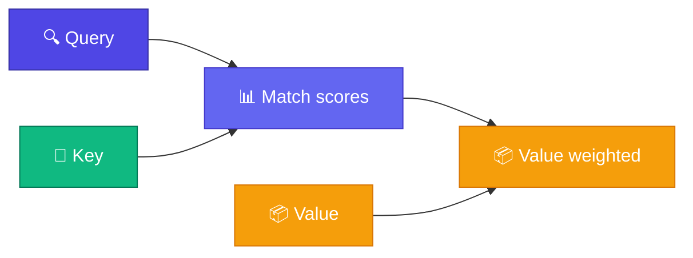

# 🔍 Query, Key, Value (Q/K/V)

<ConceptAnim name="attention-flow" caption="Query, Key, Value" />

Attention-এর heart: তিনটা vector — **Query**, **Key**, **Value**। Best analogy: **search engine**।

<Callout type="idea">
💡 Google search-এ query type করো → documents match → relevant content দেখো। Attention-এ same pattern!
</Callout>



## Search Engine Analogy

| Search Engine | Attention |
|--------------|-----------|
| Your query | **Query (Q)** — "আমি কী খুঁজছি?" |
| Document title/tags | **Key (K)** — "আমার কাছে কী আছে?" |
| Document content | **Value (V)** — "আমার actual information" |
| Relevance score | **Q · K** dot product |
| Search results | **Weighted sum of V** |

## From Embedding to Q/K/V

প্রতিটা token-এর embedding থেকে তিনটা vector বের করি — তিনটা **learned weight matrix**:

<StepReveal steps={[
  { emoji: "📊", title: "Input x", body: "Token embedding" },
  { emoji: "🔍", title: "Q = x @ Wq", body: "What am I looking for?" },
  { emoji: "🔑", title: "K = x @ Wk", body: "What do I contain?" },
  { emoji: "📦", title: "V = x @ Wv", body: "My actual info to share" }
]} />

## Example: "i like apple"

```
Token "like":
  Q_like = "subject-verb relationship খুঁজছি"
  K_i    = "I am a pronoun/subject"
  K_apple = "I am a fruit/object"
  V_i    = pronoun info
  V_apple = fruit info
```

`"like"`-এর Query `"i"`-র Key-এর সাথে high score → `"i"`-র Value বেশি weight পায়।

<Illustration name="attention-map" />

## Interactive Demo

<Playground id="part-07/qkv" title="Query, Key, Value Projection" />

## ✅ তুমি কী শিখলে?

- **Q** = what I'm looking for
- **K** = what I offer for matching
- **V** = information I contribute
- Three learned projections from embedding

**পরের lesson:** [Scaled Dot-Product](/docs/part-07-attention/03-scaled-dot-product)
