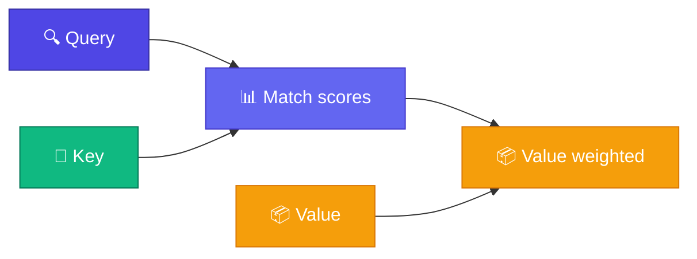

# Query, Key, Value — খোঁজা ও মিলানো

<ConceptAnim slug="part-07-attention/02-qkv" />

আগের lesson-এ দেখলে কেন সব token দেখা দরকার। এখন প্রশ্ন: **কীভাবে** relevant অংশ খুঁজে পাওয়া যায়? Attention-এর heart হলো তিনটা vector — **Query**, **Key**, **Value**। Best analogy: **search engine**।

<Callout type="idea">
Google search-এ query type করো → documents match → relevant content দেখো। Attention-এ same pattern!
</Callout>



## Search Engine-এর Analogy

| Search Engine | Attention |
|--------------|-----------|
| Your query | **Query (Q)** — "আমি কী খুঁজছি?" |
| Document title/tags | **Key (K)** — "আমার কাছে কী আছে?" |
| Document content | **Value (V)** — "আমার actual information" |
| Relevance score | **Q · K** dot product |
| Search results | **Weighted sum of V** |

Module 3-এর Dot Product মনে আছে? দুটো vector কতটা aligned — সেটাই এখানে relevance score। Query আর Key মিললে score বেশি → সেই token-এর Value বেশি weight পায়।

## Embedding থেকে Q/K/V

প্রতিটা token-এর Embedding থেকে তিনটা vector বের করি — তিনটা **learned weight matrix** দিয়ে:

<StepReveal steps={[
  { emoji: "📊", title: "Input x", body: "Token Embedding" },
  { emoji: "🔍", title: "Q = x @ Wq", body: "আমি কী খুঁজছি?" },
  { emoji: "🔑", title: "K = x @ Wk", body: "আমার কাছে কী আছে match করার?" },
  { emoji: "📦", title: "V = x @ Wv", body: "শেয়ার করার actual info" }
]} />

Module 6-এর Weight Matrix-এর মতোই — শুধু এখন একটার বদলে তিনটা projection: `Wq`, `Wk`, `Wv`।

## উদাহরণ: "i like apple"

```
Token "like":
  Q_like = "subject-verb relationship খুঁজছি"
  K_i    = "I am a pronoun/subject"
  K_apple = "I am a fruit/object"
  V_i    = pronoun info
  V_apple = fruit info
```

`"like"`-এর Query `"i"`-র Key-এর সাথে high score → `"i"`-র Value বেশি weight পায়। মানে `"like"` বুঝতে পারে তার subject `"i"`।

## নিজে চেষ্টা করো

<Playground id="part-07/qkv" title="Query, Key, Value Projection" />

## তুমি কী শিখলে?

- **Q (Query)** = আমি কী খুঁজছি
- **K (Key)** = match করার জন্য আমি কী offer করি
- **V (Value)** = আমি কী information দিই
- Embedding থেকে তিনটা **learned projection** দিয়ে Q, K, V বানানো হয়

**পরের lesson:** [Scaled Dot-Product](/docs/part-07-attention/03-scaled-dot-product)
