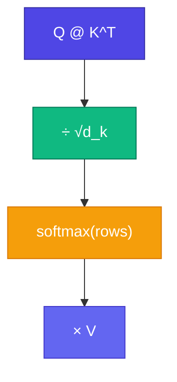

# ⚡ Scaled Dot-Product Attention

Q, K, V define করলাম — এখন **formula**: dot product, scale, softmax, weighted sum।

<Callout type="idea">
💡 **Scaled** dot-product = dot product ÷ √d_k — বড় dimension-এ softmax saturate হওয়া ঠেকায়।
</Callout>

<MathLesson title="Attention Formula">
  <MathIntuition>
    Q এবং K-এর dot product = relevance score। Softmax scores-কে probability-তে convert করে (sum=1)। তারপর V-এর weighted average নেওয়া হয়।
  </MathIntuition>
  <SymbolTable symbols={[
    { sym: "Q", meaning: "Query matrix (n × d_k)" },
    { sym: "K", meaning: "Key matrix (n × d_k)" },
    { sym: "V", meaning: "Value matrix (n × d_v)" },
    { sym: "d_k", meaning: "Key/Query dimension" },
    { sym: "n", meaning: "Sequence length (token count)" }
  ]} />
  <Formula>
    {`$$\\text{Attention}(Q, K, V) = \\text{softmax}\\left(\\frac{QK^T}{\\sqrt{d_k}}\\right) V$$`}
  </Formula>
  <WorkedExample>
    n=3 tokens, d_k=2{'\n'}
    scores = Q @ K^T / √2{'\n'}
    weights = softmax(scores)  // each row sums to 1{'\n'}
    output = weights @ V       // (3 × d_v)
  </WorkedExample>
  <CodeLink>Playground-এ formula step-by-step run করো ↓</CodeLink>
</MathLesson>

## Step by Step

**Step 1:** Score matrix = `Q @ K^T` → shape `(n, n)`

**Step 2:** Scale = divide by `√d_k`

**Step 3:** Softmax each row → attention weights (each row sums to 1)

**Step 4:** Output = weights `@ V` → context-aware vectors

## Why Scale by √d_k?

Dimension বড় হলে dot products বড় হয় → softmax **saturates** (one weight ≈ 1, rest ≈ 0). Scaling keeps gradients healthy.

<StepReveal steps={[
  { emoji: "1️⃣", title: "QK^T", body: "Pairwise relevance scores" },
  { emoji: "2️⃣", title: "÷ √d_k", body: "Prevent softmax saturation" },
  { emoji: "3️⃣", title: "softmax", body: "Scores → probabilities" },
  { emoji: "4️⃣", title: "× V", body: "Weighted information mix" }
]} />

## Interactive Demo

<Playground id="part-07/scaled-dot-product" title="Scaled Dot-Product Attention" />

## ✅ তুমি কী শিখলে?

- Attention = softmax(QK^T/√d_k) × V
- Scaling prevents gradient issues
- Output = context-mixed representation per token

**পরের lesson:** [Self-Attention](/docs/part-07-attention/04-self-attention)
