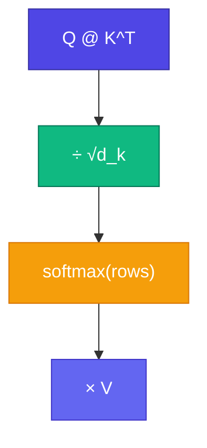

# Scaled Dot-Product — Attention Formula

<ConceptAnim slug="part-07-attention/03-scaled-dot-product" />

Q, K, V define করলাম — এখন সেগুলো দিয়ে **actual formula**। ধাপগুলো সোজা: dot product দিয়ে score, scale করো, Softmax দিয়ে probability, তারপর Value-এর weighted sum।

<Callout type="idea">
**Scaled** Dot-Product = Dot Product ÷ √d_k — বড় dimension-এ Softmax saturate হওয়া ঠেকায়।
</Callout>

Module 3-এ Softmax আর Dot Product দুটোই দেখেছ — Attention সে দুটোকে একসাথে কাজে লাগায়।

<MathLesson title="Attention Formula">
  <MathIntuition>
    Q এবং K-এর Dot Product = relevance score। Softmax scores-কে probability-তে convert করে (sum=1)। তারপর V-এর weighted average নেওয়া হয়।
  </MathIntuition>
  <SymbolTable symbols={[
    { sym: "Q", meaning: "Query matrix (n × d_k)" },
    { sym: "K", meaning: "Key matrix (n × d_k)" },
    { sym: "V", meaning: "Value matrix (n × d_v)" },
    { sym: "d_k", meaning: "Key/Query dimension" },
    { sym: "n", meaning: "Sequence length (token count)" }
  ]} />
  <Formula>
    {`$$\\text{Attention}(Q, K, V) = \\text{softmax}\\left(\\frac{QK^T}{\\sqrt{d_k}}\\right) V$$`}
  </Formula>
  <MathPractical title="গণনা দেখো (ধাপে ধাপে)">
    
১. ছোট ২×২ score matrix (QKᵀ): <code>[[2, 0], [1, 1]]</code>, এবং <code>d_k = 4</code> → <code>√d_k = 2</code>

    
২. Scale: প্রতিটা ÷ ২ → <code>[[1.0, 0.0], [0.5, 0.5]]</code>

    
৩. Row-০ Softmax: <code>e¹≈2.718</code>, <code>e⁰=1</code>, sum≈3.718 → weights ≈ <code>[0.73, 0.27]</code>

    
৪. Row-১ Softmax: <code>e⁰·⁵≈1.649</code> দুবার, sum≈3.298 → weights ≈ <code>[0.50, 0.50]</code>

    
৫. প্রতিটা row sum = 1 — এখন এই weights দিয়ে V-এর weighted average নেওয়া যায়

  </MathPractical>
  <CodeLink>Playground-এ formula step-by-step run করো ↓</CodeLink>
</MathLesson>

## Step by Step

**Step 1:** Score matrix = `Q @ K^T` → shape `(n, n)` — প্রতিটা token প্রতিটার সাথে কত relevant

**Step 2:** Scale = divide by `√d_k`

**Step 3:** Softmax each row → Attention weights (each row sums to 1)

**Step 4:** Output = weights `@ V` → context-aware vectors

## Why Scale by √d_k?

Dimension বড় হলে Dot Products বড় হয় → Softmax **saturates** (one weight ≈ 1, rest ≈ 0)। Scaling রাখে scores মাঝামাঝি — gradients healthy থাকে। ছাড়া deep training ভাঙতে পারে।

<StepReveal steps={[
  { emoji: "1️⃣", title: "QK^T", body: "Pairwise relevance scores" },
  { emoji: "2️⃣", title: "÷ √d_k", body: "Prevent Softmax saturation" },
  { emoji: "3️⃣", title: "Softmax", body: "Scores → probabilities" },
  { emoji: "4️⃣", title: "× V", body: "Weighted information mix" }
]} />

## কোড চেষ্টা করো

<Playground id="part-07/scaled-dot-product" title="Scaled Dot-Product Attention" />

## তুমি কী শিখলে?

- Attention = Softmax(QK^T/√d_k) × V
- Scaling gradient সমস্যা কমায়
- Output = প্রতিটা token-এর context-mixed representation

**পরের lesson:** [Self-Attention](/docs/part-07-attention/04-self-attention)
