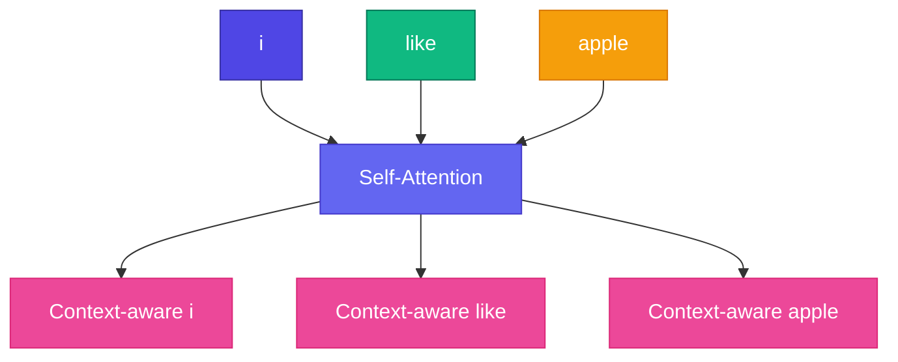

# 🔄 Self-Attention

<ConceptAnim slug="part-07-attention/04-self-attention" />

**Self-attention** = একই sequence-এর সব token একে অপরকে attend করে।

<Callout type="idea">
💡 `"i like apple"` — প্রতিটা word অন্য দুটো word-এর দিকেও তাকায়। `"like"` `"i"` এবং `"apple"` দুটোই দেখে।
</Callout>

## Attention Weights Heatmap

Example: `"i like apple"` sentence-এ attention weights:

<AttentionHeatmap
  tokens={["i", "like", "apple"]}
  weights={[
    [0.7, 0.2, 0.1],
    [0.1, 0.8, 0.1],
    [0.2, 0.3, 0.5],
  ]}
  title="Self-Attention: i like apple"
/>

**Heatmap কীভাবে পড়বে:**
- Row `"i"`: বেশিরভাগ নিজের দিকেই (0.7)
- Row `"like"`: strong self-attention (0.8)
- Row `"apple"`: `"like"` (0.3) এবং নিজের (0.5) দিকে — verb–object link!

<MathPractical title="গণনা দেখো (ধাপে ধাপে)">
  
১. Token <code>"i"</code>-এর weight row: <code>w = [0.7, 0.2, 0.1]</code> (নিজে / like / apple)

  
২. Value vectors ধরো: <code>V_i=[1,0]</code>, <code>V_like=[0,1]</code>, <code>V_apple=[1,1]</code>

  
৩. Weighted sum: <code>0.7·[1,0] + 0.2·[0,1] + 0.1·[1,1]</code>

  
৪. = <code>[0.7, 0] + [0, 0.2] + [0.1, 0.1] = [0.8, 0.3]</code>

  
৫. Output = context-aware vector — বেশিরভাগ নিজের info, একটু neighbours-এর mix

</MathPractical>

## Full Implementation

<StepReveal steps={[
  { title: "Input X", body: "3 embeddings (3 × D)" },
  { title: "Q, K, V", body: "Same X, different projections" },
  { title: "Attention weights", body: "3×3 matrix — কে কাকে দেখে" },
  { title: "Output", body: "3 context-enriched vectors" }
]} />

## Causal vs Full

| Type | Mask | Used in |
|------|------|---------|
| Full self-attention | None | BERT (encoder) |
| **Causal** (masked) | Future tokens hidden | **GPT** (decoder) |

GPT training-এ token শুধু **আগের** tokens দেখতে পায় — future cheat করা যায় না।

## কোড চেষ্টা করো

<Playground id="part-07/self-attention" title="Self-Attention on 3 Words" viz="attention" />

## ✅ তুমি কী শিখলে?

- Self-attention = token একে অপরের দিকে attend করে
- Heatmap দেখায় কে কাকে attend করছে
- GPT **causal** masked self-attention ব্যবহার করে

**পরের lesson:** [Multi-Head Attention](/docs/part-07-attention/05-multi-head)
