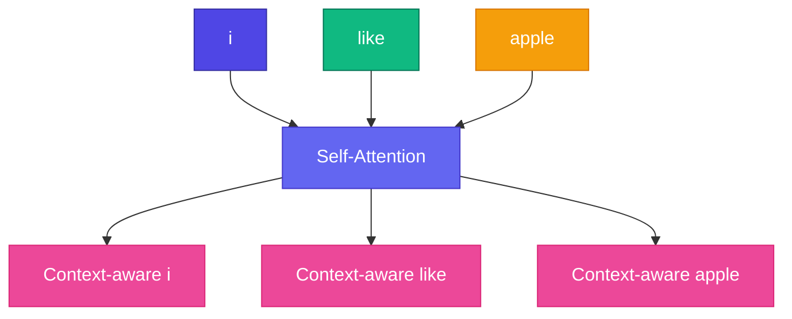

# 🔄 Self-Attention

<ConceptAnim slug="part-07-attention/04-self-attention" />

**Self-attention** = একই sequence-এর সব token একে অপরকে attend করে।

<Callout type="idea">
💡 `"i like apple"` — প্রতিটা word অন্য দুটো word-এর দিকেও তাকায়। `"like"` `"i"` এবং `"apple"` দুটোই দেখে।
</Callout>

## Attention Weights Heatmap

Example: `"i like apple"` sentence-এ attention weights:

<AttentionHeatmap
  tokens={["i", "like", "apple"]}
  weights={[
    [0.7, 0.2, 0.1],
    [0.1, 0.8, 0.1],
    [0.2, 0.3, 0.5],
  ]}
  title="Self-Attention: i like apple"
/>

**Reading the heatmap:**
- Row `"i"`: mostly attends to itself (0.7)
- Row `"like"`: strong self-attention (0.8)
- Row `"apple"`: attends to `"like"` (0.3) and itself (0.5) — verb-object link!

## Full Implementation

<StepReveal steps={[
  { emoji: "📥", title: "Input X", body: "3 embeddings (3 × D)" },
  { emoji: "🔍", title: "Q, K, V", body: "Same X, different projections" },
  { emoji: "📊", title: "Attention weights", body: "3×3 matrix — who looks at whom" },
  { emoji: "📤", title: "Output", body: "3 context-enriched vectors" }
]} />

## Causal vs Full

| Type | Mask | Used in |
|------|------|---------|
| Full self-attention | None | BERT (encoder) |
| **Causal** (masked) | Future tokens hidden | **GPT** (decoder) |

GPT training-এ token শুধু **আগের** tokens দেখতে পায় — future cheat করা যায় না।

## Interactive Demo

<Playground id="part-07/self-attention" title="Self-Attention on 3 Words" viz="attention" />

## ✅ তুমি কী শিখলে?

- Self-attention = tokens attend to each other
- Heatmap shows who-attends-to-whom
- GPT uses **causal** masked self-attention

**পরের lesson:** [Multi-Head Attention](/docs/part-07-attention/05-multi-head)
