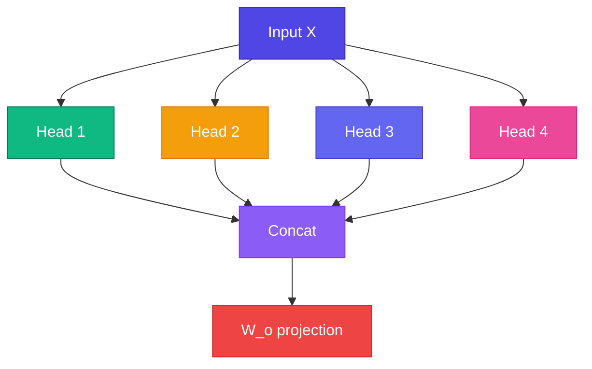

# Multi-Head — একসাথে অনেক দৃষ্টি

<ConceptAnim slug="part-07-attention/05-multi-head" />

একটা Attention head একটা pattern দেখে — subject-verb, বা pronoun reference। কিন্তু sentence-এ একসাথে অনেক সম্পর্ক থাকে। **Multi-Head** মানে: একাধিক head **parallel**-এ run করে — syntax, semantics, position আলাদা আলাদা capture।

<Callout type="idea">
Multiple experts একসাথে sentence analyze করছে — একজন grammar, একজন meaning, একজন reference track করে।
</Callout>

## Formula দেখো

$$\text{MultiHead}(Q,K,V) = \text{Concat}(\text{head}_1, ..., \text{head}_h) W_O$$

$$\text{head}_i = \text{Attention}(Q W_Q^i, K W_K^i, V W_V^i)$$

প্রতিটা head-এর নিজস্ব `W_Q`, `W_K`, `W_V` — তাই আলাদা pattern শেখে। শেষে concat করে `W_O` দিয়ে আবার model dimension-এ ফিরিয়ে আনি।

<MathPractical title="গণনা দেখো (ধাপে ধাপে)">
  
১. Shapes: <code>n = 2</code> tokens, <code>d_model = 4</code>, <code>h = 2</code> heads → প্রতি head <code>d_k = 2</code>

  
২. Input X shape: <code>(2 × 4)</code> — split হয়ে প্রতি head-এ Q/K/V: <code>(2 × 2)</code>

  
৩. Head 1 scores (এক row): <code>[2, 0]</code> → ÷ √2 ≈ <code>[1.414, 0]</code>

  
৪. Softmax: ≈ <code>[0.80, 0.20]</code> — এই head একটা pattern দেখে

  
৫. Head 2 আলাদা weights → আলাদা pattern; concat → <code>(2 × 4)</code>, তারপর <code>W_O</code> দিয়ে mix

</MathPractical>

## Multiple Heads কেন?

| Head | Might learn |
|------|-------------|
| Head 1 | Subject-verb agreement |
| Head 2 | Adjective-noun pairs |
| Head 3 | Pronoun reference (`it` → `animal`) |
| Head 4 | Position/nearby tokens |

Lesson 7.1-এর `"it"` problem মনে আছে? একটা head ঠিক সেই pronoun→noun link শিখতে পারে — অন্য head অন্য কিছু।

<StepReveal steps={[
  { emoji: "✂️", title: "Split", body: "D dimension → hটা head × (D/h) করে" },
  { emoji: "⚡", title: "Parallel Attention", body: "প্রতিটা head আলাদা Q/K/V চালায়" },
  { emoji: "🔗", title: "Concat", body: "সব head-এর output একসাথে stack" },
  { emoji: "📤", title: "W_o", body: "শেষে আবার D-তে project" }
]} />

## Typical Config দেখো

Head সংখ্যা ও `d_model` scale অনুযায়ী বাড়ে — নীচের table ও Playground-এ Multi-Head split দেখো।

## GPT-2 Style Config দেখো

| Model | Heads | d_model |
|-------|-------|---------|
| Our Mini GPT | 4 | 64 |
| GPT-2 small | 12 | 768 |
| GPT-3 | 96 | 12288 |

## নিজে চেষ্টা করো

<Playground id="part-07/multi-head" title="Multi-Head Attention" />

## তুমি কী শিখলে?

- **Multi-Head** = একসাথে parallel Attention, প্রতিটা head-এর আলাদা learned projection
- প্রতিটা head আলাদা relationship pattern ধরে (syntax, coreference, ইত্যাদি)
- শেষে **concat + output projection** দিয়ে সব head একসাথে মেশানো হয়

**পরের Module:** [Module 8 — Transformer Block](/docs/part-08-transformer)
