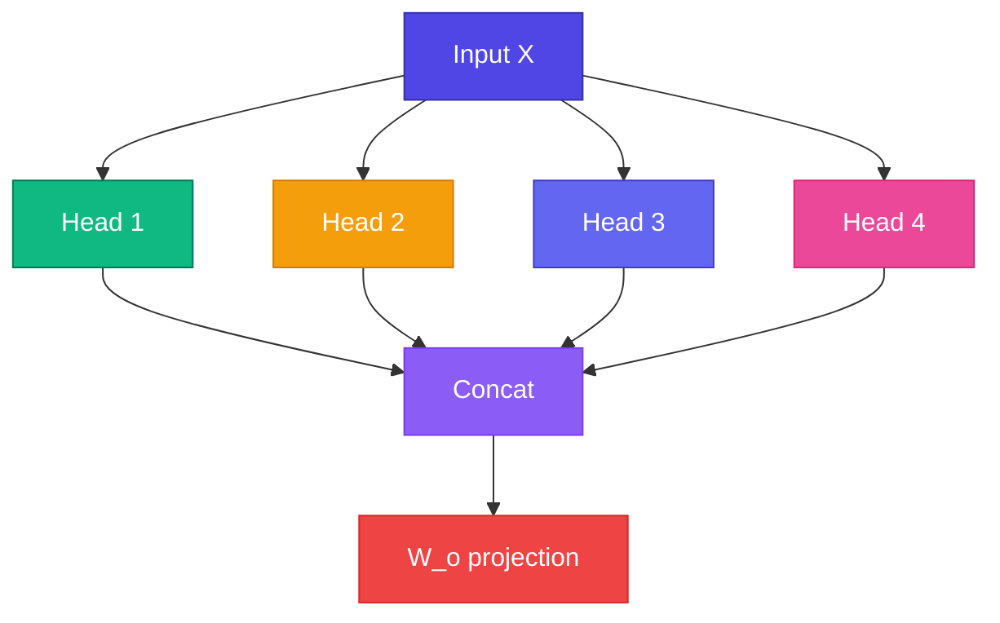

# 🎭 Multi-Head Attention

Single attention head একটা pattern দেখে। **Multi-head** = একাধিক head **parallel**-এ run করে — syntax, semantics, position সব আলাদা capture।

<Callout type="idea">
💡 Multiple experts একসাথে sentence analyze করছে — একজন grammar, একজন meaning, একজন reference track করে।
</Callout>



## Formula

$$\text{MultiHead}(Q,K,V) = \text{Concat}(\text{head}_1, ..., \text{head}_h) W_O$$

$$\text{head}_i = \text{Attention}(Q W_Q^i, K W_K^i, V W_V^i)$$

## Why Multiple Heads?

| Head | Might learn |
|------|-------------|
| Head 1 | Subject-verb agreement |
| Head 2 | Adjective-noun pairs |
| Head 3 | Pronoun reference (`it` → `animal`) |
| Head 4 | Position/nearby tokens |

<StepReveal steps={[
  { emoji: "✂️", title: "Split", body: "D dimensions → h heads × (D/h) each" },
  { emoji: "⚡", title: "Parallel attention", body: "Each head independent Q/K/V" },
  { emoji: "🔗", title: "Concat", body: "Stack all head outputs" },
  { emoji: "📤", title: "W_o", body: "Final projection back to D" }
]} />

## Typical Config

```ts
const nHead = 4;
const dModel = 64;
const dHead = dModel / nHead;  // 16 per head

// Each head: Attention with d_k = dHead
// Output: concat 4 heads → 64 dims → W_o
```

## GPT-2 Style

| Model | Heads | d_model |
|-------|-------|---------|
| Our Mini GPT | 4 | 64 |
| GPT-2 small | 12 | 768 |
| GPT-3 | 96 | 12288 |

## Interactive Demo

<Playground id="part-07/multi-head" title="Multi-Head Attention" />

## ✅ তুমি কী শিখলে?

- Multi-head = parallel attention with different learned projections
- Each head captures different relationship patterns
- Concat + output projection combines all heads

**পরের Module:** [Module 8 — Transformer Block](/docs/part-08-transformer)
