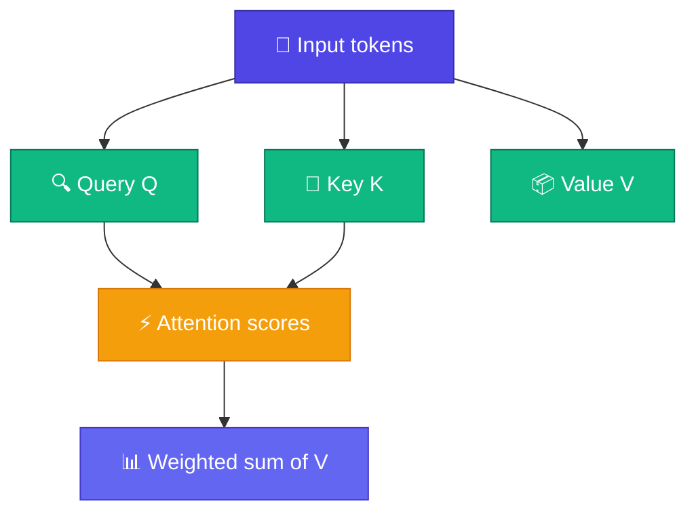

# Module 7 — Attention

Module 6-এর Neural LM শুধু **১টা আগের token** দেখে — neural bigram। Real sentence-এ দূরের word-ও গুরুত্বপূর্ণ: `"it"` কার দিকে point করে, subject কোথায় — সেসব ১-token window-এ ধরা যায় না।

**Attention** এই সমস্যার সমাধান: সব token-এর মধ্যে relevance measure করে, তারপর relevant অংশগুলো mix করে।

<Callout type="idea">
Attention = "এই word-এর জন্য sentence-এর কোন অংশ সবচেয়ে relevant?" — search engine-এর মতো।
</Callout>

এই Module-এ Query/Key/Value থেকে শুরু করে Scaled Dot-Product, Self-Attention, আর Multi-Head পর্যন্ত যাব — GPT-এর core mechanism piece by piece।

## Lessons

| # | Lesson | Topic |
|---|--------|-------|
| 7.1 | [Why Attention?](/docs/part-07-attention/01-why-attention) | Long-range dependency problem |
| 7.2 | [Query, Key, Value](/docs/part-07-attention/02-qkv) | Q/K/V search engine analogy |
| 7.3 | [Scaled Dot-Product](/docs/part-07-attention/03-scaled-dot-product) | Attention formula |
| 7.4 | [Self-Attention](/docs/part-07-attention/04-self-attention) | Full attention on sentence |
| 7.5 | [Multi-Head](/docs/part-07-attention/05-multi-head) | Parallel attention heads |

**আগের Module:** [Module 6 — Neural LM](/docs/part-06-neural-lm)

**পরের step:** [Why Attention?](/docs/part-07-attention/01-why-attention)
