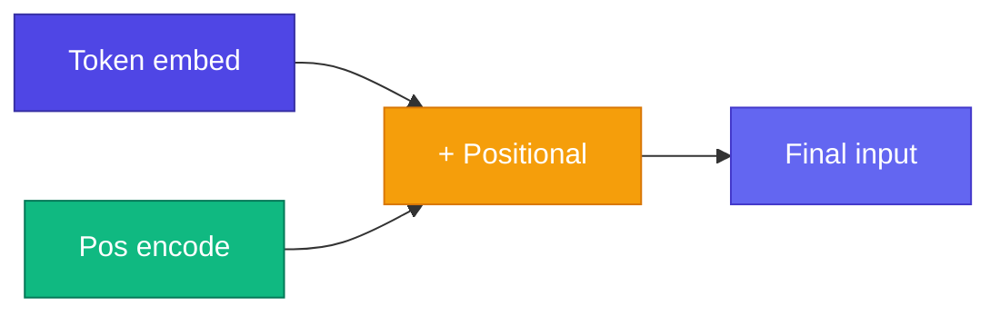

# 📍 Positional Encoding

<ConceptAnim name="llm-pipeline" caption="Positional encoding" />

Attention **order-agnostic** — `"i like apple"` এবং `"apple like i"` same attention weights পাবে (embedding same হলে)। Position info manually যোগ করতে হবে।

<Callout type="warn">
⚠️ Attention matrix permutation invariant — word order বুঝতে **positional encoding** mandatory।
</Callout>

<MathLesson title="Sinusoidal Positional Encoding">
  <MathIntuition>
    Original Transformer paper sin/cos waves ব্যবহার করে — fixed pattern, no learned params। GPT learned positional embeddings use করে, কিন্তু sin/cos intuition same।
  </MathIntuition>
  <SymbolTable symbols={[
    { sym: "pos", meaning: "Token position (0, 1, 2, ...)" },
    { sym: "i", meaning: "Dimension index within embedding" },
    { sym: "d_model", meaning: "Embedding dimension" }
  ]} />
  <Formula>
    {`$$PE_{(pos, 2i)} = \\sin\\left(\\frac{pos}{10000^{2i/d_{model}}}\\right)$$`}
    {`$$PE_{(pos, 2i+1)} = \\cos\\left(\\frac{pos}{10000^{2i/d_{model}}}\\right)$$`}
  </Formula>
  <WorkedExample>
    pos=0: PE ≈ [0, 1, 0, 1, ...] (sin=0, cos=1){'\n'}
    pos=1: PE ≈ [0.84, 0.54, 0.01, 1.0, ...]{'\n'}
    Different positions → different patterns
  </WorkedExample>
  <CodeLink>Playground-এ positional encoding add করো ↓</CodeLink>
</MathLesson>

## Two Approaches

| Method | Type | Used by |
|--------|------|---------|
| Sinusoidal | Fixed formula | Original Transformer |
| **Learned** | Trainable vector | **GPT**, Llama |

আমাদের Mini GPT **learned positional embedding** use করব — simpler, same idea।

<StepReveal steps={[
  { emoji: "🔢", title: "Position index", body: "0, 1, 2, ... for each token" },
  { emoji: "🌊", title: "PE vector", body: "sin/cos or learned lookup" },
  { emoji: "➕", title: "Add to embed", body: "token_emb + pos_emb" },
  { emoji: "📤", title: "To attention", body: "Now order-aware!" }
]} />

## Interactive Demo

<Playground id="part-08/positional" title="Positional Encoding" />

## ✅ তুমি কী শিখলে?

- Attention needs position info added manually
- Sin/cos encoding = fixed wave patterns
- GPT uses learned positional embeddings

**পরের lesson:** [LayerNorm](/docs/part-08-transformer/02-layer-norm)
