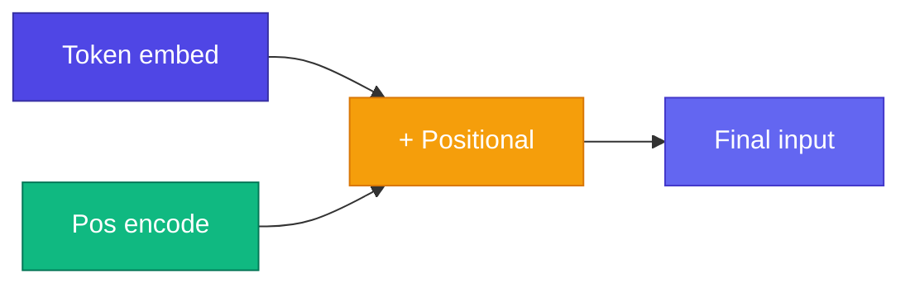

# Positional Encoding — Order যোগ করা

<ConceptAnim slug="part-08-transformer/01-positional" />

Module 7-এর Self-Attention-এ একটা catch আছে: Attention **order-agnostic**। `"i like apple"` আর `"apple like i"` — Embedding same হলে same Attention weights পাবে। Word order বোঝে না।

তাই position info **manually** যোগ করতে হয় — এটাই **Positional Encoding**।

<Callout type="warn">
Attention matrix permutation invariant — word order বুঝতে **Positional Encoding** mandatory।
</Callout>

Module 6-এর Embedding-এ শুধু “কোন word” ছিল। এখন তার সাথে “কোন position”-ও যোগ হচ্ছে — `token_emb + pos_emb`।

<MathLesson title="Sinusoidal Positional Encoding">
  <MathIntuition>
    Original Transformer paper sin/cos waves ব্যবহার করে — fixed pattern, no learned params। GPT learned positional Embeddings use করে, কিন্তু sin/cos intuition same।
  </MathIntuition>
  <SymbolTable symbols={[
    { sym: "pos", meaning: "Token position (0, 1, 2, ...)" },
    { sym: "i", meaning: "Dimension index within Embedding" },
    { sym: "d_model", meaning: "Embedding dimension" }
  ]} />
  <Formula>
    {`$$PE_{(pos, 2i)} = \\sin\\left(\\frac{pos}{10000^{2i/d_{model}}}\\right)$$`}
    {`$$PE_{(pos, 2i+1)} = \\cos\\left(\\frac{pos}{10000^{2i/d_{model}}}\\right)$$`}
  </Formula>
  <MathPractical title="গণনা দেখো (ধাপে ধাপে)">
    
১. প্রথম dimension-জোড়া (i = 0): <code>10000⁰ = 1</code> → <code>PE = [sin(pos), cos(pos)]</code>

    
২. Position 0: <code>sin(0) = 0</code>, <code>cos(0) = 1</code> → PE ≈ <code>[0, 1, …]</code>

    
৩. Position 1: <code>sin(1) ≈ 0.841</code>, <code>cos(1) ≈ 0.540</code> → PE ≈ <code>[0.841, 0.540, …]</code>

    
৪. ভিন্ন position → ভিন্ন sin/cos pattern — model order বুঝতে পারে

  </MathPractical>
  <CodeLink>Playground-এ Positional Encoding add করো ↓</CodeLink>
</MathLesson>

## Two Approaches

| Method | Type | Used by |
|--------|------|---------|
| Sinusoidal | Fixed formula | Original Transformer |
| **Learned** | Trainable vector | **GPT**, Llama |

আমাদের Mini GPT **learned positional Embedding** use করব — simpler, same idea। Module 6-এর Embedding lookup-এর মতোই, শুধু key = position index।

<StepReveal steps={[
  { emoji: "🔢", title: "Position index", body: "0, 1, 2, ... for each token" },
  { emoji: "🌊", title: "PE vector", body: "sin/cos or learned lookup" },
  { emoji: "➕", title: "Add to embed", body: "token_emb + pos_emb" },
  { emoji: "📤", title: "To Attention", body: "Now order-aware!" }
]} />

## Interactive Demo

<Playground id="part-08/positional" title="Positional Encoding" />

## তুমি কী শিখলে?

- Attention needs position info added manually
- Sin/cos encoding = fixed wave patterns
- GPT uses learned positional Embeddings

**পরের lesson:** [LayerNorm](/docs/part-08-transformer/02-layer-norm)
