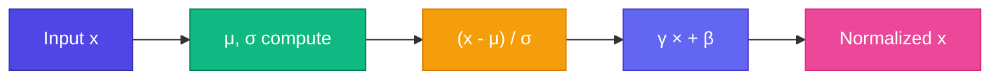

# LayerNorm — Activation স্থির রাখা

<ConceptAnim slug="part-08-transformer/02-layer-norm" />

Deep network-এ (অনেক Attention + FFN stack) activation values explode বা vanish হতে পারে — Module 4-এর vanishing gradient-এর আত্মীয় সমস্যা। **LayerNorm** প্রতিটা token-এর vector normalize করে — mean≈0, variance≈1 — যাতে training stable থাকে।

<Callout type="tip">
GPT-এ **Pre-LayerNorm** ব্যবহার হয়: Norm → Attention → Residual (norm আগে)।
</Callout>



## Formula

$$\text{LayerNorm}(x) = \gamma \cdot \frac{x - \mu}{\sqrt{\sigma^2 + \epsilon}} + \beta$$

- `μ` = mean of vector
- `σ` = standard deviation
- `γ`, `β` = learned scale and shift
- `ε` = tiny constant (divide-by-zero prevent)

Normalize করার পরও model চাইলে `γ`, `β` দিয়ে rescale/shift করতে পারে — তাই expressiveness হারায় না।

<MathPractical title="গণনা দেখো (ধাপে ধাপে)">
  <div>১. দেওয়া vector: <code>x = [2, 4, 6]</code> (একটা token-এর ৩-dim activation)</div>
  <div>২. Mean: <code>μ = (2 + 4 + 6) / 3 = 4</code></div>
  <div>৩. Variance: <code>σ² = [(2−4)² + (4−4)² + (6−4)²] / 3 = (4 + 0 + 4) / 3 = 8/3 ≈ 2.667</code></div>
  <div>৪. Std: <code>σ = √(8/3) ≈ 1.633</code> (ε ≈ 0 ধরে)</div>
  <div>৫. Normalize: <code>(x − μ) / σ ≈ [−1.225, 0, 1.225]</code></div>
  <div>৬. γ = 1, β = 0 হলে output একই — learned γ, β পরে rescale/shift করে</div>
</MathPractical>

## Per-Token কেন?

BatchNorm batch dimension-এ normalize করে — language model-এ sequence length variable, তাই **per-token LayerNorm** better fit। প্রতিটা token নিজের vector-এর ভিতরেই normalize হয়।

<StepReveal steps={[
  { emoji: "📊", title: "Compute μ, σ", body: "Mean and std of token vector" },
  { emoji: "➖", title: "Center", body: "x - μ" },
  { emoji: "➗", title: "Scale", body: "Divide by σ" },
  { emoji: "⚖️", title: "γ, β", body: "Learned rescale + shift" }
]} />

## Transformer Block-এ

```
x → LayerNorm → Attention → + x (residual)
  → LayerNorm → FFN → + x (residual)
```

Norm **before** each sub-layer (Pre-LN) — modern GPT standard। Residual পরে আসবে; এখন শুধু মনে রাখো: Attention/FFN-এর আগে LayerNorm।

## নিজে চেষ্টা করো

<Playground id="part-08/layer-norm" title="LayerNorm" />

## তুমি কী শিখলে?

- LayerNorm প্রতিটা token-এর activation stabilize করে
- Pre-LN: Attention/FFN-এর আগে normalize
- Learned γ, β দিয়ে model norm-এর পর rescale করতে পারে

**পরের lesson:** [Feed-Forward Network](/docs/part-08-transformer/03-ffn)
