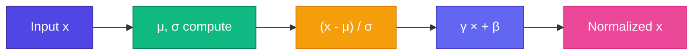

# 📏 LayerNorm

Deep network-এ activation values explode বা vanish হতে পারে। **LayerNorm** প্রতিটা token-এর vector normalize করে — training stable রাখে।

<Callout type="tip">
✅ GPT-এ **Pre-LayerNorm** ব্যবহার হয়: Norm → Attention → Residual (norm আগে)।
</Callout>



## Formula

$$\text{LayerNorm}(x) = \gamma \cdot \frac{x - \mu}{\sqrt{\sigma^2 + \epsilon}} + \beta$$

- `μ` = mean of vector
- `σ` = standard deviation
- `γ`, `β` = learned scale and shift
- `ε` = tiny constant (divide-by-zero prevent)

## Why Per-Token?

BatchNorm batch dimension-এ normalize করে — language model-এ sequence length variable, তাই **per-token LayerNorm** better fit।

```ts
function layerNorm(x: number[], gamma: number[], beta: number[]): number[] {
  const mu = mean(x);
  const sigma = std(x);
  return x.map((v, i) => gamma[i] * (v - mu) / (sigma + 1e-5) + beta[i]);
}
```

<StepReveal steps={[
  { emoji: "📊", title: "Compute μ, σ", body: "Mean and std of token vector" },
  { emoji: "➖", title: "Center", body: "x - μ" },
  { emoji: "➗", title: "Scale", body: "Divide by σ" },
  { emoji: "⚖️", title: "γ, β", body: "Learned rescale + shift" }
]} />

## In Transformer Block

```
x → LayerNorm → Attention → + x (residual)
  → LayerNorm → FFN → + x (residual)
```

Norm **before** each sub-layer (Pre-LN) — modern GPT standard.

## Interactive Demo

<Playground id="part-08/layer-norm" title="LayerNorm" />

## ✅ তুমি কী শিখলে?

- LayerNorm stabilizes activations per token
- Pre-LN: normalize before attention/FFN
- Learned γ, β allow model to rescale after norm

**পরের lesson:** [Feed-Forward Network](/docs/part-08-transformer/03-ffn)
