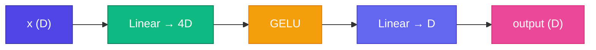

# 🔧 Feed-Forward Network (FFN)

<ConceptAnim slug="part-08-transformer/03-ffn" />

Attention tokens-এর মধ্যে information mix করে। **FFN** প্রতিটা token-এ independently **non-linear transformation** apply করে — "think deeper" step।

<Callout type="idea">
💡 FFN = position-wise MLP: same network every token-এ, কিন্তু tokens parallel process হয়।
</Callout>

## Architecture

$$\text{FFN}(x) = W_2 \cdot \text{GELU}(W_1 \cdot x + b_1) + b_2$$

- Expand: `D → 4D` (typically 4× embedding size)
- Activation: **GELU** (GPT) or ReLU
- Project back: `4D → D`

## Why 4× Expansion?

Wider hidden layer = more capacity to transform each token's representation after attention mixing.

<StepReveal steps={[
  { emoji: "📈", title: "Expand", body: "D → 4D linear projection" },
  { emoji: "⚡", title: "GELU", body: "Non-linear activation" },
  { emoji: "📉", title: "Project", body: "4D → D back to model dim" },
  { emoji: "🔄", title: "Per token", body: "Same FFN, all tokens parallel" }
]} />

## Attention vs FFN Roles

| Component | Role |
|-----------|------|
| Attention | **Mix** information between tokens |
| FFN | **Transform** each token's representation |

## Parameter Count

FFN often has **most parameters** in a transformer block — 2 matrices of size D×4D and 4D×D.

## Interactive Demo

<Playground id="part-08/ffn" title="Feed-Forward Network" />

## ✅ তুমি কী শিখলে?

- FFN = position-wise 2-layer MLP
- Expand 4× → GELU → project back
- Complements attention (mix vs transform)

**পরের lesson:** [Residual Connections](/docs/part-08-transformer/04-residual)
