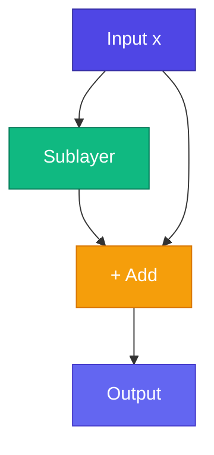

# 🔗 Residual Connections

<ConceptAnim name="train-loop" caption="Residual connection" />

Deep network train করা কঠিন — gradient vanish হয়। **Residual (skip) connections** input directly output-এ add করে — gradient highway তৈরি করে।

<Callout type="idea">
💡 Residual = `output = sublayer(x) + x` — network শুধু **change (delta)** learn করে, full mapping নয়।
</Callout>



## Formula

$$\text{output} = x + \text{Sublayer}(x)$$

Sublayer = Attention or FFN (with LayerNorm before it in Pre-LN).

## Why It Works

<StepReveal steps={[
  { emoji: "🛤️", title: "Gradient highway", body: "Gradient flows directly through + path" },
  { emoji: "📐", title: "Learn delta", body: "Sublayer learns change, not full transform" },
  { emoji: "🏗️", title: "Stack deep", body: "12+ layers trainable (GPT-2)" },
  { emoji: "🔄", title: "Identity default", body: "Untrained sublayer ≈ pass-through" }
]} />

## In Transformer Block

```
x ──────────────────────────────┐
  ↓ LayerNorm                     │
  ↓ Attention                     │
  └→ (+) ←───────────────────────┘  (residual 1)

x ──────────────────────────────┐
  ↓ LayerNorm                     │
  ↓ FFN                           │
  └→ (+) ←───────────────────────┘  (residual 2)
```

দুটো residual connection per block — একটা attention-এ, একটা FFN-এ।

## Without vs With Residual

| Without | With Residual |
|---------|---------------|
| 6 layers max useful | 12+ layers work |
| Gradient vanishes | Gradient flows |
| Hard to train | Stable training |

## Interactive Demo

<Playground id="part-08/residual" title="Residual Connections" />

## ✅ তুমি কী শিখলে?

- Residual = `output = x + sublayer(x)`
- Enables deep networks (many stacked blocks)
- Two residuals per transformer block

**পরের lesson:** [Full Transformer Block](/docs/part-08-transformer/05-block)
