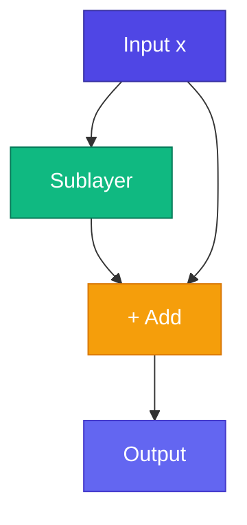

# Residual — Shortcut দিয়ে Deep Train

<ConceptAnim slug="part-08-transformer/04-residual" />

GPT-তে অনেকগুলো Transformer Block stack হয়। Deep network train করা কঠিন — gradient vanish হয় (Module 4-এর কথা মনে আছে?)। **Residual (skip) connections** input সরাসরি output-এ add করে — একটা gradient highway তৈরি করে।

<Callout type="idea">
Residual = `output = sublayer(x) + x` — network শুধু **change (delta)** learn করে, full mapping নয়।
</Callout>

মানে Attention বা FFN পুরো representation আবার বানায় না — শুধু “কী change করতে হবে” শেখে। আগের information `+ x` দিয়ে থেকে যায়।



## Formula দেখো

$$\text{output} = x + \text{Sublayer}(x)$$

Sublayer = Attention or FFN (with LayerNorm before it in Pre-LN)। আগের দুই lesson-এর piece এখানেই জোড়া লাগে।

## কেন কাজ করে

<StepReveal steps={[
  { emoji: "🛤️", title: "Gradient highway", body: "Gradient সরাসরি + path দিয়ে যায়" },
  { emoji: "📐", title: "Delta শেখে", body: "Sublayer পুরো transform নয় — পরিবর্তন শেখে" },
  { emoji: "🏗️", title: "Stack deep", body: "12+ layers trainable (GPT-2)" },
  { emoji: "🔄", title: "Identity default", body: "Untrained sublayer ≈ pass-through" }
]} />

## Transformer Block-এ

```
x ──────────────────────────────┐
  ↓ LayerNorm                     │
  ↓ Attention                     │
  └→ (+) ←───────────────────────┘  (residual 1)

x ──────────────────────────────┐
  ↓ LayerNorm                     │
  ↓ FFN                           │
  └→ (+) ←───────────────────────┘  (residual 2)
```

দুটো Residual connection per block — একটা Attention-এ, একটা FFN-এ। Module index-এর diagram-এর `+ Residual` boxes এগুলোই।

## Residual ছাড়া vs সহ

| Without | With Residual |
|---------|---------------|
| 6 layers max useful | 12+ layers work |
| Gradient vanishes | Gradient flows |
| Hard to train | Stable training |

## নিজে চেষ্টা করো

<Playground id="part-08/residual" title="Residual Connections" />

## তুমি কী শিখলে?

- **Residual** = `output = x + sublayer(x)` — shortcut connection
- অনেক stacked block-এর deep network সম্ভব করে (gradient পথ খোলা রাখে)
- Transformer Block-এ সাধারণত **দুটো** Residual থাকে

**পরের lesson:** [Full Transformer Block](/docs/part-08-transformer/05-block)
