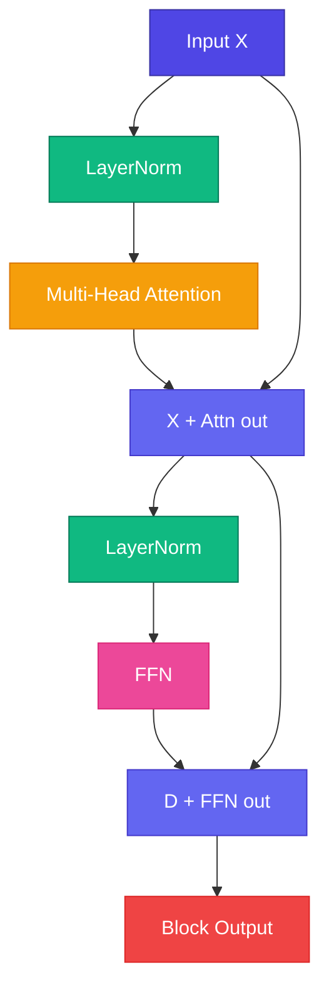

# 🏗️ Full Transformer Block

<ConceptAnim name="llm-pipeline" caption="Transformer block assembly" />

সব piece ready — এখন **assemble**: LayerNorm → Multi-Head Attention → Residual → LayerNorm → FFN → Residual। এটাই GPT-এর core building block।

<Callout type="tip">
✅ GPT = N transformer blocks stacked + final LayerNorm + output projection to vocabulary.
</Callout>

<Illustration name="transformer-block" />



## Complete Code

<StepReveal steps={[
  { emoji: "1️⃣", title: "Norm → Attn → +", body: "Context mixing with skip" },
  { emoji: "2️⃣", title: "Norm → FFN → +", body: "Per-token transform with skip" },
  { emoji: "3️⃣", title: "Stack N blocks", body: "Mini GPT: 4 blocks" },
  { emoji: "4️⃣", title: "Final head", body: "LayerNorm → logits → softmax" }
]} />

## Mini GPT Stack

```
Token IDs
  → Token Embedding + Positional Embedding
  → Block 1 → Block 2 → Block 3 → Block 4
  → Final LayerNorm
  → Linear → Vocabulary logits
```

## Parameter Overview

| Component | Params (approx) |
|-----------|-----------------|
| Embeddings | V × D |
| Each block | 4 × D² (attn + FFN) |
| 4 blocks | ~16 × D² |

## Interactive Demo

<Playground id="part-08/block" title="Full Transformer Block" />

## ✅ তুমি কী শিখলে?

- Full block = Pre-LN Attn + Residual + Pre-LN FFN + Residual
- Stack N blocks = GPT body
- Module 8 complete — next: **Mini GPT** end-to-end!

**পরের Module:** [Module 9 — Mini GPT](/docs/part-09-mini-gpt)
