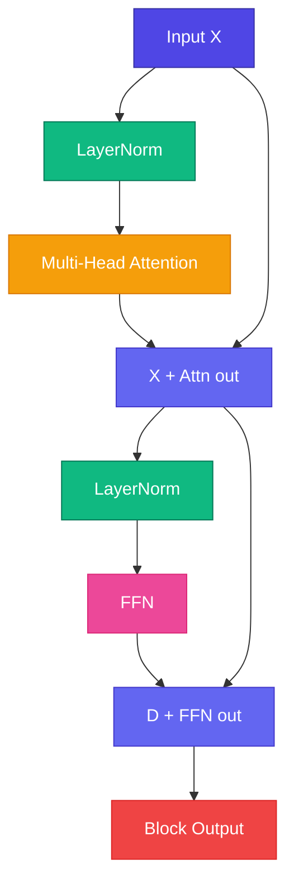

# Full Block — সব Piece একসাথে

<ConceptAnim slug="part-08-transformer/05-block" />

Positional Encoding, LayerNorm, Multi-Head Attention, FFN, Residual — সব piece ready। এখন **assemble**: LayerNorm → Multi-Head Attention → Residual → LayerNorm → FFN → Residual। এটাই GPT-এর core building block।

<Callout type="tip">
GPT = N Transformer Blocks stacked + final LayerNorm + output projection to vocabulary।
</Callout>

Module 6-এর simple Embed → W → Softmax থেকে অনেক দূর এসেছ — এখন context-aware, position-aware, deep-stackable architecture।



## Complete Code দেখো

<StepReveal steps={[
  { emoji: "1️⃣", title: "Norm → Attn → +", body: "Skip সহ context মিক্স" },
  { emoji: "2️⃣", title: "Norm → FFN → +", body: "Skip সহ per-token transform" },
  { emoji: "3️⃣", title: "Nটা block stack", body: "Mini GPT: 4 blocks" },
  { emoji: "4️⃣", title: "Final head", body: "LayerNorm → logits → Softmax" }
]} />

## Mini GPT-এর Stack

```
Token IDs
  → Token Embedding + Positional Embedding
  → Block 1 → Block 2 → Block 3 → Block 4
  → Final LayerNorm
  → Linear → Vocabulary logits
```

এই stack-ই Module 9-এ end-to-end train করবে — fruit corpus দিয়ে, ছোট scale-এ।

## Parameter Overview দেখো

| Component | Params (approx) |
|-----------|-----------------|
| Embeddings | V × D |
| Each block | 4 × D² (attn + FFN) |
| 4 blocks | ~16 × D² |

## নিজে চেষ্টা করো

<Playground id="part-08/block" title="Full Transformer Block" />

## তুমি কী শিখলে?

- Full block = **Pre-LN Attention + Residual** তারপর **Pre-LN FFN + Residual**
- Nটা block stack করলেই GPT-এর body তৈরি হয়
- Module 8 শেষ — পরের ধাপ: end-to-end **Mini GPT**!

**পরের Module:** [Module 9 — Mini GPT](/docs/part-09-mini-gpt)
