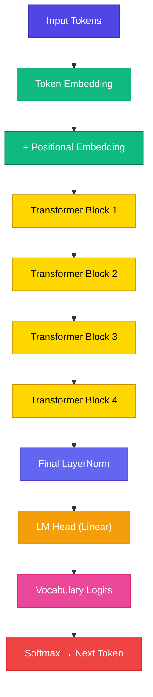
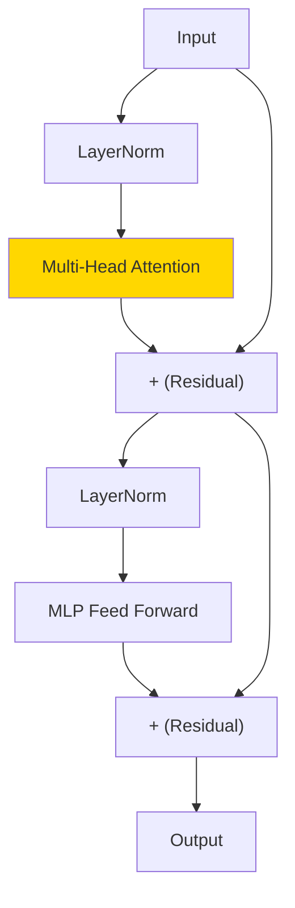

# GPT Architecture

<ConceptAnim slug="part-09-mini-gpt/01-gpt-architecture" />

Module 1 থেকে 8 পর্যন্ত যে building blockগুলো আলাদা আলাদা শিখেছ — Tokenizer, Embedding, Attention, Transformer Block — এখন সেগুলো এক জায়গায় বসবে। **GPT architecture** মানেই: token ঢোকে → কয়েকটা block পার হয় → পরের token বের হয়।

<Callout type="idea">
💡 GPT = **Generative Pre-trained Transformer** — decoder-only, causal self-attention, autoregressive generation। নাম লম্বা, কিন্তু ধারণা একটাই: আগের token দেখে পরেরটা predict।
</Callout>

## Transformer Block (সংক্ষেপে)

Module 8-এ যে block assemble করেছ, সেটাই এখানে N বার stack হবে। একটার ভিতর দেখলে এমন:

## Mini GPT-এর Config

আমাদের ছোট্ট model — fruit corpus-এ চলবে, browser-এ fit হবে:

| Hyperparameter | Value |
|----------------|-------|
| Vocabulary | ~30 fruit words |
| d_model | 64 |
| n_heads | 4 |
| n_layers | 4 |
| seq_len | 32 |
| ~Lines of code | 500 |

<StepReveal steps={[
  { emoji: "🔤", title: "Embed", body: "Token + positional lookup" },
  { emoji: "🧱", title: "4 Blocks", body: "প্রতিটাতে Attention + FFN" },
  { emoji: "📏", title: "Final Norm", body: "Output-এর আগে stabilize" },
  { emoji: "🎯", title: "LM Head", body: "D → V logits" }
]} />

## Componentগুলোর Map

প্রতিটা piece আগে কোন Module-এ এসেছিল — মনে করিয়ে দিই:

| Component | Module | Role |
|-----------|--------|------|
| Tokenizer | 1 | Text → IDs |
| Embedding | 6 | ID → vector |
| Attention | 7 | Context mixing |
| Transformer block | 8 | Full block |
| Training | 6 | Loss + update |
| Generation | 2, 6 | Autoregressive |

## vs nanoGPT — তফাত

| | Our Mini GPT | Karpathy nanoGPT |
|---|-------------|------------------|
| Language | TypeScript | Python/PyTorch |
| Size | ~500 lines | ~300 lines |
| Dataset | Fruit sentences | Shakespeare |
| Runtime | Browser (esbuild-wasm) | GPU |

<Callout type="tip">
✅ Architecture **একই** — শুধু language আর scale আলাদা। Module 10-এ nanoGPT line-by-line পড়ব; তখন দেখবে formula-ও মিলে যায়।
</Callout>

## তুমি কী শিখলে?

- **GPT** = embed + Nটা Transformer block + LM head
- Decoder-only, **causal attention** — শুধু past দেখে
- আমাদের Mini GPT = same architecture, শুধু ছোট scale

**পরের lesson:** [Train Mini GPT](/docs/part-09-mini-gpt/02-train)
