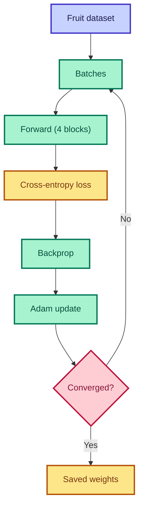

# Train Mini GPT

<ConceptAnim slug="part-09-mini-gpt/02-train" />

Architecture বুঝলাম — এখন **train** করব fruit dataset-এ। Forward pass, cross-entropy loss, backprop, weight update — full loop।

<Callout type="warn">
⚠️ পুরো training browser-এ **esbuild-wasm runtime**-এ চলে (~500 lines TypeScript) — dataset ছোট বলে কয়েক second-এ train হয়।
</Callout>



## Training Loop

<LossChart data={[3.2, 2.1, 1.5, 1.0, 0.8, 0.6]} title="Mini GPT Training Loss" />

## Dataset

Fruit sentences from Module 1:

```
"i like apple"
"apple is fruit"
"banana is healthy"
"i like banana"
...
```

<StepReveal steps={[
  { emoji: "📂", title: "Load data", body: "Tokenized fruit sentences" },
  { emoji: "🔀", title: "Batch", body: "Random windows of length T" },
  { emoji: "🧠", title: "Forward", body: "4 transformer blocks" },
  { emoji: "📉", title: "Loss + update", body: "Cross-entropy + Adam" }
]} />

## What Gets Trained

| Parameter | Shape | Count |
|-----------|-------|-------|
| Token embed | V × D | ~2K |
| Pos embed | T × D | ~2K |
| 4 blocks | ~16D² each | ~260K |
| LM head | D × V | ~2K |

## Interactive Demo

<Playground id="part-09/train" title="Train Mini GPT" />

## ✅ তুমি কী শিখলে?

- Full GPT training loop in TypeScript
- Loss should decrease over steps
- All weights (embed, blocks, head) learned jointly

**পরের lesson:** [Generate Text](/docs/part-09-mini-gpt/03-generate)
