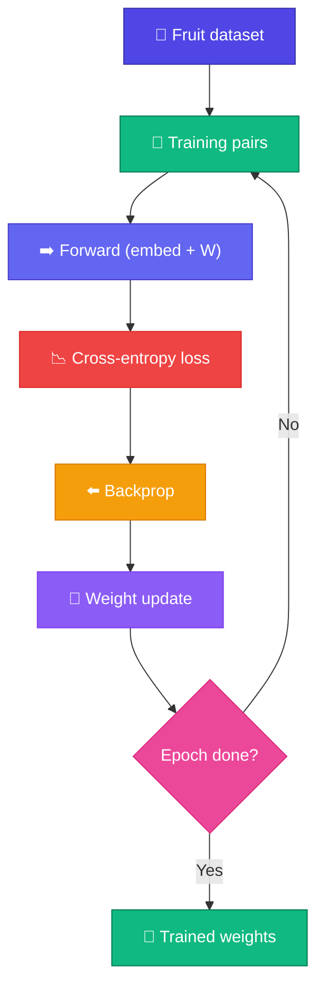

# 🏋️ Train Mini GPT

<ConceptAnim name="train-loop" caption="Train Mini GPT" />

Architecture বুঝলাম — এখন **train** করব fruit dataset-এ। Forward pass, cross-entropy loss, backprop, weight update — full loop।

<Callout type="warn">
⚠️ Browser-এ full transformer training ভারী — এই Playground-এ **simplified word-level trainer** দেখাবে। Architecture lesson-এ যা শিখেছ, সেই loop-এর same pattern: forward → loss → backward → update।
</Callout>



## Training Loop

<LossChart data={[3.2, 2.1, 1.5, 1.0, 0.8, 0.6]} title="Mini GPT Training Loss" />

## Dataset

Fruit sentences from Module 1:

```
"i like apple"
"apple is fruit"
"fruit is healthy"
"i like banana"
...
```

<Callout type="tip">
💡 Full Mini GPT-তে 4টি transformer block + Adam optimizer থাকে। Playground-এ fruit dataset-এ **word-level neural LM** train করব — same training loop, ছোট architecture।
</Callout>

<StepReveal steps={[
  { emoji: "📂", title: "Load data", body: "Tokenized fruit sentences" },
  { emoji: "🔀", title: "Pairs", body: "Bigram-style (word → next word)" },
  { emoji: "🧠", title: "Forward", body: "Embedding + weight matrix → logits" },
  { emoji: "📉", title: "Loss + update", body: "Cross-entropy + gradient descent" }
]} />

## What Gets Trained (Playground)

| Parameter | Shape | Role |
|-----------|-------|------|
| Embedding E | V × D | Word ID → vector |
| Weight W | V × D | Vector → logits |
| LM head (full GPT) | D × V | Module 9 architecture lesson-এ |

## Interactive Demo

<Playground id="part-09/train" title="Train Mini GPT" />

## ✅ তুমি কী শিখলে?

- Full GPT training loop-এর pattern: forward → loss → backward → update
- Browser Playground-এ fruit dataset-এ simplified trainer run করা যায়
- Loss gradually কমতে থাকলে model শিখছে

**পরের lesson:** [Generate Text](/docs/part-09-mini-gpt/03-generate)
