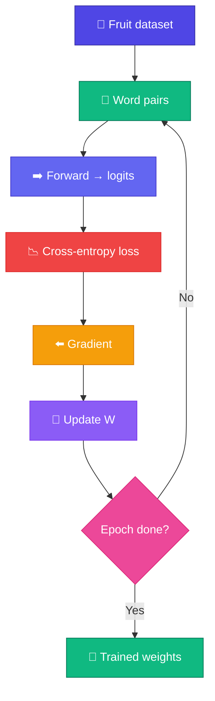

# 🏋️ Train Mini GPT

<ConceptAnim name="train-loop" caption="Train on fruit corpus — loss drops over epochs" />

Architecture বুঝলাম — এখন **train** করব fruit dataset-এ। Forward pass, cross-entropy loss, weight update — full loop।

<Callout type="warn">
⚠️ Browser sandbox-এ full 4-block GPT train করা heavy। Interactive demo-তে **word-level neural next-token model** চালাই (Module 6-এর মতো) — same fruit corpus, same loss curve idea। Architecture diagram-এ যে stack দেখেছো, সেটাই production path।
</Callout>



## Training Loop

<LossChart data={[3.2, 2.1, 1.5, 1.0, 0.8, 0.6]} title="Mini GPT Training Loss" />

## Dataset

Module 1-এর same fruit sentences:

```
"i like apple"
"apple is fruit"
"banana is fruit"
"fruit is healthy"
...
```

<StepReveal steps={[
  { emoji: "📂", title: "Load data", body: "Tokenized fruit sentences" },
  { emoji: "🔗", title: "Pairs", body: "(word_i → word_{i+1})" },
  { emoji: "🧠", title: "Forward", body: "Logits over vocabulary" },
  { emoji: "📉", title: "Loss + update", body: "Cross-entropy + gradient step" }
]} />

## What the Demo Trains

| Piece | Shape | Role |
|-------|-------|------|
| Weight `W` | V × V | Current word → next-word logits |
| Softmax | V | Probabilities |
| Update | GD | Lower cross-entropy |

Full GPT-তে এখানে embedding + N transformer blocks + LM head থাকবে — Module 8-এর block stack।

## Interactive Demo

<Playground id="part-09/train" title="Train Mini GPT (simplified)" viz="loss" />

## ✅ তুমি কী শিখলে?

- Training loop: forward → loss → update → repeat
- Loss should decrease over epochs
- Browser demo simplified; architecture target = full GPT stack

**পরের lesson:** [Generate Text](/docs/part-09-mini-gpt/03-generate)
